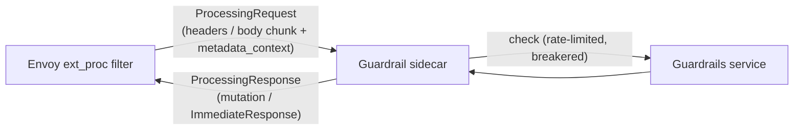
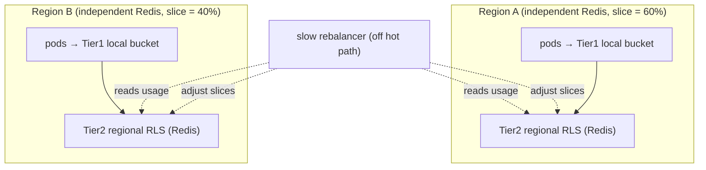

# ADR — Guardrail `ext_proc` Sidecar and Guardrails Service

**Status:** Accepted
**Scope:** The Envoy `ext_proc` external processor (the guardrail sidecar) and the upstream
guardrails service only. Covers request-path and response-path guardrails (streaming and
non-streaming), rate limiting, multi-region AWS deployment, active/passive evaluation, and
resiliency.
**Assumption (given, not re-derived here):** the per-request guardrail profile is already produced
by OPA (via `ext_authz`) and delivered to this sidecar as **dynamic metadata**. How OPA computes it
is out of scope. This ADR begins where that metadata arrives on the `ext_proc` stream.

> **Citation policy for this document.** Every table and every line that rests on external behaviour
> cites the exact page **and section**. A consolidated [Source ledger](#source-ledger) at the end
> lists each source, its URL and section anchor, the claims it supports, and whether it was
> *fetched-and-read* or *search-confirmed* during authoring. No claim about Envoy, Redis/ElastiCache,
> or AWS behaviour appears here without a source.

---

## Decision capsule

- **Decision:** Implement guardrails as a Python `ext_proc` sidecar that Envoy drives over a
  bidirectional gRPC stream. It reads OPA's profile from `metadata_context`, inspects/mutates the
  request and response bodies (buffered for non-streaming, rolling-window for streaming), blocks via
  `ImmediateResponse`, calls the upstream guardrails service under a two-tier rate limiter and an
  application circuit breaker, and runs candidate models passively via the stream's native
  observability mode.
- **Why:** only `ext_proc` can both inspect and mutate a streaming body and short-circuit it mid
  flight; the classifier call is the dominant, least-predictable latency and must be bounded; and
  the classifier is a shared, finite, multi-region resource that must be rate-limited without
  cross-region calls on the hot path.
- **Rejected:** doing classifier work in `ext_authz` (cannot mutate or see streaming bodies);
  per-chunk classification (cost); writing rate-limit counters to a cross-region replica (ElastiCache
  Global Datastore secondaries are read-only).
- **Consequence:** a bounded, observable, resilient inline guardrail with deterministic failure
  behaviour — at the cost of operating the sidecar, a regional rate-limit service per region, and a
  slow cross-region budget rebalancer.

---

## 0. Why `ext_proc` (mechanism selection)

The guardrail must do two things to an LLM message: **inspect the full body** (prompt and streamed
response) and **mutate or block** it. Envoy offers four ways to run custom logic on a request; only
one does both for a streaming body. The governing constraint is flow control: Envoy proxies
arbitrarily large bodies only when **all** L7 filters stream; a filter that buffers the body is
bounded by the listener buffer limit, and a body exceeding it yields a 413 (request) or a 500 /
mid-response disconnect (response) ([Envoy FAQ — Flow control](https://www.envoyproxy.io/docs/envoy/latest/faq/configuration/flow_control)).

| Mechanism | Read full body? | Mutate body? | Stream (no full buffer)? | See response body? | Call external classifier? | Source (page §section) |
|---|---|---|---|---|---|---|
| **`ext_authz`** | No — only a capped request prefix (`with_request_body` / `max_request_bytes`, 413 on overflow); marked partial via `x-envoy-auth-partial-body` | No (decision + headers only) | No (decides before body complete) | **No** | Is the external call (decision only) | [ext_authz filter](https://www.envoyproxy.io/docs/envoy/latest/configuration/http/http_filters/ext_authz_filter) |
| **`ext_proc`** | **Yes** — full body in chunks | **Yes** — headers, body, trailers | **Yes** (`STREAMED`/`FULL_DUPLEX_STREAMED`) | **Yes** | Yes — the processor *is* an external gRPC service | [ext_proc filter §External Processing](https://www.envoyproxy.io/docs/envoy/latest/configuration/http/http_filters/ext_proc_filter#external-processing) |
| **Lua** | `body()` buffers the **entire** body; `bodyChunks()` streams without buffering | Yes (incl. `chunk:setBytes` per chunk) | **Yes** via `bodyChunks()` | Yes | `httpCall()` only — buffers the request body (413 >1 MB), no general async client | [Lua filter (`body`, `bodyChunks`)](https://www.envoyproxy.io/docs/envoy/latest/configuration/http/http_filters/lua_filter); [envoy#16674 (httpCall buffers)](https://github.com/envoyproxy/envoy/issues/16674) |
| **Wasm** | Yes — `getBufferBytes` / `setBuffer(HttpRequestBody)`, with `StopIterationAndBuffer` to accumulate | Yes | Buffering bodies at scale hits hard buffer + Wasm memory limits | Yes | `httpCall` from the module | [envoy#17208 (setBuffer works)](https://github.com/envoyproxy/envoy/issues/17208); [Proxy-Wasm buffering caution](https://github.com/Kong/ngx_wasm_module/blob/main/docs/PROXY_WASM.md) |

**Reading the table honestly (corrections to common belief):**

- `ext_authz` is genuinely decision-only: it sees only a capped, possibly-truncated *request* body
  prefix and **never the response body** — so it cannot inspect a model's answer or redact anything
  ([ext_authz filter](https://www.envoyproxy.io/docs/envoy/latest/configuration/http/http_filters/ext_authz_filter)).
  This is why OPA-via-`ext_authz` is the right home for the *decision* but not for inspection.
- **Lua is not disqualified by "can't stream."** `bodyChunks()` explicitly streams: it "returns an
  iterator … as they arrive … Envoy will yield the script in between chunks, but will not buffer
  them … to inspect data as it is streaming by" ([Lua filter](https://www.envoyproxy.io/docs/envoy/latest/configuration/http/http_filters/lua_filter)).
  It is disqualified because the only way to call an external classifier is `httpCall()`, which
  buffers the request body (413 over ~1 MB — [envoy#16674](https://github.com/envoyproxy/envoy/issues/16674))
  and is an embedded-scripting primitive, not a production async client with libraries.
- **Wasm can mutate bodies** (`setBuffer(HttpRequestBody)` works — [envoy#17208](https://github.com/envoyproxy/envoy/issues/17208)),
  but the Proxy-Wasm guidance is blunt that buffering bodies at scale has "fundamental issues … hard
  buffer limits … and Wasm memory limits … should be used with extreme caution in production"
  ([Proxy-Wasm doc](https://github.com/Kong/ngx_wasm_module/blob/main/docs/PROXY_WASM.md), an
  ecosystem source, not Envoy-official).
- **`ext_proc`** is the only mechanism that reads and mutates a **streaming response** body *and*
  naturally calls an external classifier (the processor itself is that service), without the
  per-filter buffering ceiling for the streamed path. Hence the decision.

> **Source tiers in this table.** Filter behaviours are Envoy-official docs; the `httpCall`/`setBuffer`
> rows are backed by Envoy GitHub issues (primary, issue-tracker tier) and one ecosystem doc
> (Proxy-Wasm), all marked as such here and in the [ledger](#source-ledger). Verify against your
> Envoy version.

---

## 1. Component and protocol

The external processing filter connects an external gRPC service ("external processor") into
Envoy's filter chain so it can examine and modify the headers, body, and trailers of each message,
or return a brand-new response ([ext_proc filter §External Processing](https://www.envoyproxy.io/docs/envoy/latest/configuration/http/http_filters/ext_proc_filter#external-processing)).
The protocol is a **bidirectional gRPC stream**: Envoy sends `ProcessingRequest` messages and the
processor replies with `ProcessingResponse` messages ([ext_proc filter §External Processing](https://www.envoyproxy.io/docs/envoy/latest/configuration/http/http_filters/ext_proc_filter#external-processing)).
The processor may change which events it receives on a message-by-message basis, to eliminate
unnecessary stream traffic ([ext_proc filter §External Processing](https://www.envoyproxy.io/docs/envoy/latest/configuration/http/http_filters/ext_proc_filter#external-processing)).

**How OPA's decision arrives.** Each `ProcessingRequest` carries a `metadata_context` field, defined
as "Dynamic metadata associated with the request"
([external_processor proto §ProcessingRequest](https://www.envoyproxy.io/docs/envoy/latest/api-v3/service/ext_proc/v3/external_processor.proto#service-ext-proc-v3-processingrequest)).
OPA's profile (produced by `ext_authz`, which emits dynamic metadata only when its `CheckResponse`
contains a non-empty `dynamic_metadata` field — [ext_authz filter §Dynamic metadata](https://www.envoyproxy.io/docs/envoy/latest/configuration/http/http_filters/ext_authz_filter)) is exactly
what lands here. The sidecar reads the profile from `metadata_context` and never has to call OPA.

A `ProcessingRequest` contains **precisely one** of `request_headers`, `response_headers`,
`request_body`, `response_body`, `request_trailers`, or `response_trailers`
([external_processor proto §ProcessingRequest](https://www.envoyproxy.io/docs/envoy/latest/api-v3/service/ext_proc/v3/external_processor.proto#service-ext-proc-v3-processingrequest)).
Body messages each carry "a chunk of the HTTP request body" / "a chunk of the HTTP response body"
([external_processor proto §ProcessingRequest](https://www.envoyproxy.io/docs/envoy/latest/api-v3/service/ext_proc/v3/external_processor.proto#service-ext-proc-v3-processingrequest)).

---

## 2. Processing modes (what the sidecar asks Envoy to send)

The `processing_mode` controls which parts of the request/response are streamed to the sidecar.
Defaults, verbatim from the proto:

| Field | Default | Source (page §section) |
|---|---|---|
| `request_header_mode` | `SEND` | [processing_mode proto §ProcessingMode](https://www.envoyproxy.io/docs/envoy/latest/api-v3/extensions/filters/http/ext_proc/v3/processing_mode.proto#extensions-filters-http-ext-proc-v3-processingmode) |
| `response_header_mode` | `SEND` | [processing_mode proto §ProcessingMode](https://www.envoyproxy.io/docs/envoy/latest/api-v3/extensions/filters/http/ext_proc/v3/processing_mode.proto#extensions-filters-http-ext-proc-v3-processingmode) |
| `request_body_mode` | `NONE` | [processing_mode proto §ProcessingMode](https://www.envoyproxy.io/docs/envoy/latest/api-v3/extensions/filters/http/ext_proc/v3/processing_mode.proto#extensions-filters-http-ext-proc-v3-processingmode) |
| `response_body_mode` | `NONE` | [processing_mode proto §ProcessingMode](https://www.envoyproxy.io/docs/envoy/latest/api-v3/extensions/filters/http/ext_proc/v3/processing_mode.proto#extensions-filters-http-ext-proc-v3-processingmode) |
| `request_trailer_mode` | `SKIP` | [processing_mode proto §ProcessingMode](https://www.envoyproxy.io/docs/envoy/latest/api-v3/extensions/filters/http/ext_proc/v3/processing_mode.proto#extensions-filters-http-ext-proc-v3-processingmode) |
| `response_trailer_mode` | `SKIP` | [processing_mode proto §ProcessingMode](https://www.envoyproxy.io/docs/envoy/latest/api-v3/extensions/filters/http/ext_proc/v3/processing_mode.proto#extensions-filters-http-ext-proc-v3-processingmode) |

Because both body modes default to `NONE`, the sidecar **must** explicitly opt into body processing.
The `BodySendMode` enum determines *how* a body is delivered
([processing_mode proto §BodySendMode](https://www.envoyproxy.io/docs/envoy/latest/api-v3/extensions/filters/http/ext_proc/v3/processing_mode.proto#enum-extensions-filters-http-ext-proc-v3-processingmode-bodysendmode)):

| Body mode | Delivery (verbatim from the enum) | Use here | Source (page §section) |
|---|---|---|---|
| `BUFFERED` | "Buffer the message body in memory and send the entire body at once. If the body exceeds the configured buffer limit, then the downstream system will receive an error." | Non-streaming response inspection | [processing_mode proto §BodySendMode](https://www.envoyproxy.io/docs/envoy/latest/api-v3/extensions/filters/http/ext_proc/v3/processing_mode.proto#enum-extensions-filters-http-ext-proc-v3-processingmode-bodysendmode) |
| `BUFFERED_PARTIAL` | "Buffer the message body in memory and send the entire body in one chunk. If the body exceeds the configured buffer limit, then the body contents up to the buffer limit will be sent." | Request prompt inspection | [processing_mode proto §BodySendMode](https://www.envoyproxy.io/docs/envoy/latest/api-v3/extensions/filters/http/ext_proc/v3/processing_mode.proto#enum-extensions-filters-http-ext-proc-v3-processingmode-bodysendmode) |
| `STREAMED` | Body **split across multiple messages** (chunks delivered as they arrive) | Streaming response (rolling window) | [ext_proc proto](https://www.envoyproxy.io/docs/envoy/latest/api-v3/extensions/filters/http/ext_proc/v3/ext_proc.proto) |
| `FULL_DUPLEX_STREAMED` | Split across messages; required for streamed local responses; per-message timeout does not apply | Advanced streaming cut-off | [ext_proc proto](https://www.envoyproxy.io/docs/envoy/latest/api-v3/extensions/filters/http/ext_proc/v3/ext_proc.proto) |

> **Content-length on mutation.** In `BUFFERED` + `SEND` mode, the content-length header is allowed
> but the processor must set it to match the mutated body length, or the mutation is rejected and a
> local error reply is sent ([processing_mode proto §BodySendMode](https://www.envoyproxy.io/docs/envoy/latest/api-v3/extensions/filters/http/ext_proc/v3/processing_mode.proto#enum-extensions-filters-http-ext-proc-v3-processingmode-bodysendmode)).
> Removing content-length enables chunked transfer encoding where feasible (same source).

> Verbatim: "In BUFFERED or BUFFERED_PARTIAL mode, the body is sent to the external processor in a
> single message. In STREAMED or FULL_DUPLEX_STREAMED mode, the body will be split across multiple
> messages." ([ext_proc proto](https://www.envoyproxy.io/docs/envoy/latest/api-v3/extensions/filters/http/ext_proc/v3/ext_proc.proto))

---

## 3. Request-path guardrails (non-streaming)

The request prompt is small and arrives before the model is called, so the sidecar buffers it.

1. Envoy sends `request_headers`, then the request body per `request_body_mode`
   ([external_processor proto §ProcessingRequest](https://www.envoyproxy.io/docs/envoy/latest/api-v3/service/ext_proc/v3/external_processor.proto#service-ext-proc-v3-processingrequest)).
2. The sidecar reads OPA's profile from `metadata_context` (§1), assembles the prompt, checks the
   rate-limit budget (§6), and calls the guardrails service (§9 for resilience).
3. On the verdict it replies with one `ProcessingResponse`:
   - **block** → `immediate_response` (§5),
   - **redact** → a `BodyResponse` mutation masking flagged spans,
   - **allow** → continue unmutated.

Each non-observability `ProcessingRequest` requires the processor to send back a matching
`ProcessingResponse`, an `ImmediateResponse`, or close the stream
([external_processor proto §ProcessingRequest](https://www.envoyproxy.io/docs/envoy/latest/api-v3/service/ext_proc/v3/external_processor.proto#service-ext-proc-v3-processingrequest)).

---

## 4. Response-path guardrails (non-streaming and streaming)

### 4a. Non-streaming responses (`BUFFERED`)

For a complete (non-SSE) response, the sidecar requests `response_body_mode: BUFFERED`, receives the
whole body in a single message ([ext_proc proto](https://www.envoyproxy.io/docs/envoy/latest/api-v3/extensions/filters/http/ext_proc/v3/ext_proc.proto)),
checks it once, and returns a mutation or an `ImmediateResponse`. Simple, at the cost of holding the
full body before release.

### 4b. Streaming responses (`STREAMED`, rolling window)

LLM responses stream as many body chunks. With `response_body_mode: STREAMED` the body is split
across multiple messages ([ext_proc proto](https://www.envoyproxy.io/docs/envoy/latest/api-v3/extensions/filters/http/ext_proc/v3/ext_proc.proto)),
each delivered as a `response_body` chunk
([external_processor proto §ProcessingRequest](https://www.envoyproxy.io/docs/envoy/latest/api-v3/service/ext_proc/v3/external_processor.proto#service-ext-proc-v3-processingrequest)).
The sidecar accumulates a **rolling window** (a sliding buffer plus overlap so phrases split across
chunks are not missed) and checks once per window rather than per chunk, to bound classifier cost.

Two postures, a per-profile choice. (The forwarding/cut mechanisms these rely on are the
`BodyResponse` mutation and `immediate_response` defined in
[external_processor proto §ProcessingResponse](https://www.envoyproxy.io/docs/envoy/latest/api-v3/service/ext_proc/v3/external_processor.proto#service-ext-proc-v3-processingresponse);
the stream-first vs buffer-first decision itself is a design choice, not an Envoy feature.)

| Posture | Behaviour | Trade-off | Basis |
|---|---|---|---|
| **Stream-first** | Forward each chunk to the client immediately (return the chunk unmutated), check asynchronously | Best latency; a few unsafe tokens may briefly reach the client before a cut | design choice; cut via `immediate_response` ([proto §ProcessingResponse](https://www.envoyproxy.io/docs/envoy/latest/api-v3/service/ext_proc/v3/external_processor.proto#service-ext-proc-v3-processingresponse)) |
| **Buffer-first** | Hold each chunk's `BodyResponse` until its window passes | No unsafe token reaches the client; higher latency | design choice; holds the `BodyResponse` ([proto §ProcessingResponse](https://www.envoyproxy.io/docs/envoy/latest/api-v3/service/ext_proc/v3/external_processor.proto#service-ext-proc-v3-processingresponse)) |

**Cutting a streaming response.** When a window's verdict is block, the sidecar issues
`immediate_response`, which attempts to create a locally generated response, send it downstream, and
**stop processing additional filters and ignore any additional messages**; if a response has already
started it either ships the reply directly to the downstream codec or **resets the stream**
([external_processor proto, `immediate_response` field](https://www.envoyproxy.io/docs/envoy/latest/api-v3/service/ext_proc/v3/external_processor.proto#service-ext-proc-v3-processingresponse)).
For richer streamed local replies there is `streamed_immediate_response`, which is presently
supported only with `FULL_DUPLEX_STREAMED` or `NONE` body modes
([external_processor proto, `streamed_immediate_response` field](https://www.envoyproxy.io/docs/envoy/latest/api-v3/service/ext_proc/v3/external_processor.proto#service-ext-proc-v3-processingresponse)).

> **Note on `FULL_DUPLEX_STREAMED`:** in this mode the per-message timeout does not apply, and the
> `ProcessingResponse` cadence follows that mode's specific API rather than one-response-per-request
> ([ext_proc proto, message_timeout](https://www.envoyproxy.io/docs/envoy/latest/api-v3/extensions/filters/http/ext_proc/v3/ext_proc.proto); [external_processor proto §ProcessingResponse](https://www.envoyproxy.io/docs/envoy/latest/api-v3/service/ext_proc/v3/external_processor.proto#service-ext-proc-v3-processingresponse)).

---

## 5. Blocking and redaction mechanics

**Block** uses `immediate_response`: a locally generated response is sent downstream and all further
filter processing and remote messages are ignored
([external_processor proto, `immediate_response`](https://www.envoyproxy.io/docs/envoy/latest/api-v3/service/ext_proc/v3/external_processor.proto#service-ext-proc-v3-processingresponse)).

**Redact** uses a body mutation in the `BodyResponse`. The sidecar applies spans left-to-right while
rebuilding the string so earlier edits don't shift later offsets. When body mutation is enabled the
ext_proc filter removes the content-length header (unless explicitly allowed)
([processing_mode proto §BodySendMode](https://www.envoyproxy.io/docs/envoy/latest/api-v3/extensions/filters/http/ext_proc/v3/processing_mode.proto#enum-extensions-filters-http-ext-proc-v3-processingmode-bodysendmode)) — relevant because masked text changes body length.

**Allow** returns the matching `BodyResponse`/`HeadersResponse` unmutated.

---

## 6. Rate limiting the upstream checks

The guardrails service is shared, finite, and expensive, and the rate-limit check sits on the hot
path. We use the **two-stage pattern Envoy itself recommends**: a local token bucket can absorb very
large bursts that might otherwise overwhelm a global rate-limit service, so coarse local limiting
runs first and a fine-grained global limit finishes the job
([global rate limiting §arch overview](https://www.envoyproxy.io/docs/envoy/latest/intro/arch_overview/other_features/global_rate_limiting)).
Envoy's reference rate-limit service is a Go implementation backed by Redis
([global rate limiting §arch overview](https://www.envoyproxy.io/docs/envoy/latest/intro/arch_overview/other_features/global_rate_limiting)).

| Tier | Mechanism | Scope | Source (page §section) |
|---|---|---|---|
| 1 — local | Token bucket per pod (sidecar-internal, or Envoy `local_ratelimit`) | Within a pod; burst absorption | [global rate limiting (two-stage)](https://www.envoyproxy.io/docs/envoy/latest/intro/arch_overview/other_features/global_rate_limiting); [local rate limit filter](https://www.envoyproxy.io/docs/envoy/latest/configuration/http/http_filters/local_rate_limit_filter) |
| 2 — global | Regional Rate Limit Service over gRPC, Redis-backed | Across pods in a region | [global rate limiting (RLS, Redis)](https://www.envoyproxy.io/docs/envoy/latest/intro/arch_overview/other_features/global_rate_limiting) |

**Descriptors and cost weighting.** Global limits are keyed on **descriptors** (ordered key/value
tuples), and a per-descriptor `hits_addend` lets a single request consume more than one unit — so an
expensive check (long-prompt injection classifier) can be charged proportionally more than a cheap
one ([rate-limit descriptor proto](https://www.envoyproxy.io/docs/envoy/latest/api-v3/extensions/common/ratelimit/v3/ratelimit.proto)). Descriptor set:

| Descriptor | Purpose |
|---|---|
| `(guardrails_global)` | Fleet-wide cap protecting the service |
| `(agent_id)` | Per-agent ceiling (both token flows) |
| `(agent_id, check)` | Isolate an expensive check |
| `(agent_id, priority)` | `active` vs `shadow`; shadow shed first |
| `(agent_id, user_oid)` | Per-user fairness on delegated traffic |

> The descriptor model and `hits_addend` are **search-confirmed** against the descriptor proto (see
> ledger), not fetched-and-read in this authoring pass; verify the field on the linked page for your
> Envoy version before relying on the exact name.

---

## 7. Multi-region AWS deployment

Two things deploy per region: the **guardrails service** (co-located so the classifier round trip
stays in-region) and the **regional rate-limit Redis** (Tier 2). The cross-region question is how
budgets coordinate, and here an AWS-specific constraint drives the design.

**ElastiCache Global Datastore replicates Redis across regions, but secondaries are read-only.** AWS
documents that to use cross-region replication you have a primary cluster that is read/write and a
secondary that "it's just read and must be in another region"
([ElastiCache Global Datastore (DR workshop)](https://disaster-recovery.workshop.aws/en/services/databases/elasticache/global-datastore.html)),
with cross-region replication latency "typically under one second"
([ElastiCache Global Datastore (AWS What's New)](https://aws.amazon.com/about-aws/whats-new/2020/03/amazon-elasticache-for-redis-announces-global-datastore/)),
and promotion of a secondary to primary "in less than a minute" on regional degradation
([ElastiCache Global Datastore (AWS features)](https://aws.amazon.com/elasticache/features/global-datastore/)).

The consequence is decisive for a **distributed counter**: you cannot have each region write its
rate-limit counters to a local Global Datastore replica, because only the primary region accepts
writes. So:

| Option | Write path | Verdict |
|---|---|---|
| Single Global Datastore, all regions write | Cross-region write to the one primary (read/write) on every hot-path decision | **Rejected** — adds cross-region latency to the hot path; secondaries are read-only ([DR workshop](https://disaster-recovery.workshop.aws/en/services/databases/elasticache/global-datastore.html)) |
| **Independent regional Redis per region + static budget slices** | Region-local writes only; no cross-region replication of counters | **Chosen** — hot path never leaves the region |
| Global Datastore for DR of *config*, not counters | Counters region-local; Global Datastore used (if at all) only for non-counter shared state with <1 s lag and <1 min failover ([AWS features](https://aws.amazon.com/elasticache/features/global-datastore/)) | Optional |

Each region holds a static **slice** of each agent's global budget in its own independent Redis. A
slow control loop (off the hot path) reads per-region usage and rebalances slices; because it is
slow and off-path it can tolerate cross-region reads. The hot path is always region-local, which is
the property the latency budget requires.

---

## 8. Active / passive evaluation

A new guardrail model version must be validated against live traffic with **zero** effect on users
before it enforces. The `ext_proc` stream has a **native fire-and-forget mode** for exactly this.

**`observability_mode`.** When a `ProcessingRequest` has `observability_mode: true`, "the server
should not respond to this message, as any responses will be ignored"
([external_processor proto §ProcessingRequest](https://www.envoyproxy.io/docs/envoy/latest/api-v3/service/ext_proc/v3/external_processor.proto#service-ext-proc-v3-processingrequest)).
This is the safe substrate for passive evaluation: a candidate model can observe traffic with its
verdicts structurally unable to alter the response.

Design on top of that primitive:

- **Active** version: enforced — its verdict drives block/redact/allow (§3–§5).
- **Passive (shadow)** versions: the sidecar additionally calls the candidate, records a PII-safe
  diff (offsets + entity types, never substrings), and never lets it affect the response. Shadow
  draws from the `(agent_id, priority=shadow)` budget and is shed first (§6).
- **Promotion** flips active↔shadow in policy data; the sidecar simply calls a different version.

`ProcessingResponse` also exposes `mode_override`, letting the processor adjust the processing mode
going forward ([external_processor proto §ProcessingResponse](https://www.envoyproxy.io/docs/envoy/latest/api-v3/service/ext_proc/v3/external_processor.proto#service-ext-proc-v3-processingresponse)) — useful to escalate a sampled request into fuller processing.

> Do not shadow per chunk on the streaming path (it doubles classifier calls); shadow the whole
> response once at end-of-window, sampled.

---

## 9. Resiliency

Failure must be **bounded and deterministic** at three layers.

### 9a. The per-message timeout (Envoy → sidecar)

Envoy resets a per-message timer whenever it sends a message that requires a response, and errors the
stream if no matching response arrives in time; **if not configured the default is 200 ms**
([ext_proc proto, message_timeout](https://www.envoyproxy.io/docs/envoy/latest/api-v3/extensions/filters/http/ext_proc/v3/ext_proc.proto)).
There is no timeout in observability mode or in `FULL_DUPLEX_STREAMED`/`GRPC` body send modes
([ext_proc proto, message_timeout](https://www.envoyproxy.io/docs/envoy/latest/api-v3/extensions/filters/http/ext_proc/v3/ext_proc.proto)).
A check that legitimately needs longer must use `override_message_timeout`
([external_processor proto §ProcessingResponse](https://www.envoyproxy.io/docs/envoy/latest/api-v3/service/ext_proc/v3/external_processor.proto#service-ext-proc-v3-processingresponse)),
which requires `max_message_timeout ≥ 1 ms` to be enabled
([ext_proc proto, max_message_timeout](https://www.envoyproxy.io/docs/envoy/latest/api-v3/extensions/filters/http/ext_proc/v3/ext_proc.proto)).
So: the guardrails call must comfortably fit inside the configured message timeout, or explicitly
request more.

### 9b. The sidecar → guardrails-service call (application circuit breaker)

The sidecar wraps the guardrails HTTP call in a tight read timeout and an **application-level circuit
breaker** (error-rate based). On timeout or open breaker it returns an explicit `error` verdict, which
the profile's fail mode turns into an outcome — **fail-closed** ⇒ 503 via `immediate_response`,
**fail-open** ⇒ allow degraded and record. (This is an application pattern, not an Envoy feature; the
Envoy-level controls are 9c.)

### 9c. Envoy cluster circuit breaking + outlier detection (Envoy → guardrails cluster)

For the upstream guardrails *cluster*, Envoy provides cluster-level circuit breaking with hard caps —
maximum connections, pending requests, requests, retries, and connection pools — and increments
overflow counters (`upstream_cx_overflow`, `upstream_rq_pending_overflow`, `upstream_rq_retry_overflow`)
when a cap is hit ([circuit breaking §arch overview](https://www.envoyproxy.io/docs/envoy/latest/intro/arch_overview/upstream/circuit_breaking)).
Envoy recommends retry budgets, or, with static circuit breaking, aggressively breaking retries so
sporadic-failure retries are allowed but overall retry volume cannot explode into cascading failure
([circuit breaking §arch overview](https://www.envoyproxy.io/docs/envoy/latest/intro/arch_overview/upstream/circuit_breaking)).
Pair with outlier detection to passively eject unhealthy guardrails hosts.

| Layer | Control | Trips on | Source (page §section) |
|---|---|---|---|
| Envoy→sidecar | `message_timeout` (200 ms default) | No response in time | [ext_proc proto, message_timeout](https://www.envoyproxy.io/docs/envoy/latest/api-v3/extensions/filters/http/ext_proc/v3/ext_proc.proto) |
| sidecar→service | application circuit breaker + read timeout | Error rate / latency | application pattern (no Envoy source) |
| Envoy→service cluster | cluster circuit breaking + outlier detection | Resource caps / host health | [circuit breaking §arch overview](https://www.envoyproxy.io/docs/envoy/latest/intro/arch_overview/upstream/circuit_breaking) |

### 9d. Sidecar unavailability

`failure_mode_allow` on the `ext_proc` filter governs what happens if the sidecar itself is
unreachable; its use is counted by the `failure_mode_allowed` statistic
([ext_proc filter §Statistics](https://www.envoyproxy.io/docs/envoy/latest/configuration/http/http_filters/ext_proc_filter#statistics)).
For a guardrail, set this **closed** (do not allow on sidecar failure) for regulated agents; the
choice is a safety decision, not a default to inherit blindly.

---

## 10. Observability hooks (native, no extra service)

The ext_proc filter already emits the signals needed to operate this, so we consume them rather than
inventing parallel metrics.

**Statistics** ([ext_proc filter §Statistics](https://www.envoyproxy.io/docs/envoy/latest/configuration/http/http_filters/ext_proc_filter#statistics)):

| Stat | Meaning (guardrail relevance) |
|---|---|
| `streams_started` | request volume through the sidecar |
| `message_timeouts` | sidecar/classifier too slow vs the 200 ms budget (§9a) |
| `failure_mode_allowed` | how often a sidecar failure was allowed through (§9d) |
| `immediate_responses_sent` | blocks / cuts issued (§5) |
| `rejected_header_mutations` | mutation attempts Envoy refused |
| `streams_failed` | gRPC stream errors |

**Access-log filter-state fields** ([ext_proc filter §Access Log Fields](https://www.envoyproxy.io/docs/envoy/latest/configuration/http/http_filters/ext_proc_filter#access-log-fields)):

| Field | Meaning |
|---|---|
| `request_body_call_count` / `response_body_call_count` | number of body chunks processed (streaming window count) |
| `request_header_latency_us` / `response_header_latency_us` | per-phase processing latency |
| `response_body_total_latency_us` / `response_body_max_latency_us` | streaming check latency profile |
| `immediate_responses_sent` | per-request block indicator |

These cover the guardrail's own latency and block-rate without storing any prompt or completion
content.

---

## Consequences

- The guardrail is a single `ext_proc` sidecar whose every behaviour — receive metadata, inspect,
  mutate, block, stream-cut, time out — maps to a documented Envoy primitive, each cited above.
- Streaming safety is a real, surfaced trade-off (stream-first vs buffer-first), not a hidden default.
- Rate limiting stays region-local on the hot path; the AWS read-only-secondary constraint is
  designed around, not into, the system.
- Passive evaluation rests on a native stream primitive (`observability_mode`), so a candidate model
  is *structurally* unable to affect users.
- Failure is bounded at three independent layers with distinct, cited controls.

**Honesty notes (not yet verified):** the Python sidecar code, the exact `local_ratelimit` and
descriptor field names, and the rebalancer are design-level and have **not** been run against a live
Envoy/Redis. The two items marked *search-confirmed* in the ledger (`hits_addend`/descriptors,
`ext_authz` dynamic-metadata emission) should be re-checked on their linked pages for your Envoy
version before you depend on exact field names.

---

## Source ledger

Every external source this ADR relies on, with the section used, the claims it supports, and the
verification level during authoring (**Fetched** = page retrieved and read this pass; **Search** =
confirmed via search excerpts, not full-page fetch this pass).

| # | Source | URL (with section anchor) | Supports | Verification |
|---|---|---|---|---|
| 1 | Envoy — External Processing filter, §External Processing | https://www.envoyproxy.io/docs/envoy/latest/configuration/http/http_filters/ext_proc_filter#external-processing | bidirectional gRPC stream; ProcessingRequest/Response; inspect/modify headers/body/trailers or return new response; per-message reconfiguration | Fetched |
| 2 | Envoy — External Processing filter, §Statistics | https://www.envoyproxy.io/docs/envoy/latest/configuration/http/http_filters/ext_proc_filter#statistics | stats table (streams_started, message_timeouts, failure_mode_allowed, immediate_responses_sent, rejected_header_mutations, streams_failed) | Fetched |
| 3 | Envoy — External Processing filter, §Access Log Fields | https://www.envoyproxy.io/docs/envoy/latest/configuration/http/http_filters/ext_proc_filter#access-log-fields | access-log filter-state field table | Fetched |
| 4 | Envoy — External processing service proto, §ProcessingRequest | https://www.envoyproxy.io/docs/envoy/latest/api-v3/service/ext_proc/v3/external_processor.proto#service-ext-proc-v3-processingrequest | `metadata_context` = dynamic metadata; body chunks; "precisely one of"; `observability_mode` semantics | Fetched |
| 5 | Envoy — External processing service proto, §ProcessingResponse | https://www.envoyproxy.io/docs/envoy/latest/api-v3/service/ext_proc/v3/external_processor.proto#service-ext-proc-v3-processingresponse | `immediate_response` (stop processing, reset stream); `streamed_immediate_response` (FULL_DUPLEX_STREAMED/NONE only); `dynamic_metadata`; `mode_override`; `override_message_timeout` | Fetched |
| 6 | Envoy — ext_proc filter proto | https://www.envoyproxy.io/docs/envoy/latest/api-v3/extensions/filters/http/ext_proc/v3/ext_proc.proto | `message_timeout` default 200 ms; no timeout in observability/FULL_DUPLEX_STREAMED/GRPC; `max_message_timeout`; BUFFERED/BUFFERED_PARTIAL single message vs STREAMED/FULL_DUPLEX_STREAMED split | Fetched |
| 7 | Envoy — ext_proc processing_mode proto, §ProcessingMode / §BodySendMode | https://www.envoyproxy.io/docs/envoy/latest/api-v3/extensions/filters/http/ext_proc/v3/processing_mode.proto#extensions-filters-http-ext-proc-v3-processingmode | header mode default SEND; body mode default NONE; trailer mode default SKIP; BodySendMode enum; content-length removal on body mutation | Fetched |
| 8 | Envoy — Global rate limiting (arch overview) | https://www.envoyproxy.io/docs/envoy/latest/intro/arch_overview/other_features/global_rate_limiting | two-stage local token bucket + global; reference RLS is Go + Redis | Fetched (prior pass) |
| 9 | Envoy — Local rate limit filter | https://www.envoyproxy.io/docs/envoy/latest/configuration/http/http_filters/local_rate_limit_filter | per-instance token bucket (Tier 1) | Search |
| 10 | Envoy — Rate limit descriptor proto | https://www.envoyproxy.io/docs/envoy/latest/api-v3/extensions/common/ratelimit/v3/ratelimit.proto | descriptors; per-descriptor `hits_addend` request cost | Search |
| 11 | Envoy — External Authorization filter, §Dynamic metadata | https://www.envoyproxy.io/docs/envoy/latest/configuration/http/http_filters/ext_authz_filter | `ext_authz` emits dynamic metadata when CheckResponse has non-empty `dynamic_metadata` (how OPA's profile reaches the sidecar) | Search |
| 12 | Envoy — Circuit breaking (arch overview) | https://www.envoyproxy.io/docs/envoy/latest/intro/arch_overview/upstream/circuit_breaking | cluster caps (connections/pending/requests/retries/pools); overflow counters; retry-budget guidance | Fetched |
| 13 | AWS — ElastiCache Global Datastore (DR workshop) | https://disaster-recovery.workshop.aws/en/services/databases/elasticache/global-datastore.html | primary read/write, secondary read-only in another region | Fetched |
| 14 | AWS — ElastiCache Global Datastore (What's New, 2020) | https://aws.amazon.com/about-aws/whats-new/2020/03/amazon-elasticache-for-redis-announces-global-datastore/ | cross-region replication latency typically under 1 second; encryption in transit | Fetched |
| 15 | AWS — ElastiCache Global Datastore (Features) | https://aws.amazon.com/elasticache/features/global-datastore/ | promote secondary to primary in <1 minute; geo-local reads | Fetched |
| 16 | Envoy — FAQ: Flow control | https://www.envoyproxy.io/docs/envoy/latest/faq/configuration/flow_control | streaming filters proxy arbitrary bodies; buffering filters bounded by listener limit → 413/500 | Search |
| 17 | Envoy — Lua filter (`body`, `bodyChunks`) | https://www.envoyproxy.io/docs/envoy/latest/configuration/http/http_filters/lua_filter | `body()` buffers entire body; `bodyChunks()` streams without buffering and can mutate | Search |
| 18 | Envoy GitHub #16674 — Lua `httpCall` buffers request body | https://github.com/envoyproxy/envoy/issues/16674 | `httpCall` buffers the original request body (413 >1 MB) | Search (issue tracker) |
| 19 | Envoy GitHub #17208 — Wasm `setBuffer(HttpRequestBody)` | https://github.com/envoyproxy/envoy/issues/17208 | Wasm can read/mutate request body buffer | Search (issue tracker) |
| 20 | Proxy-Wasm docs (Kong ngx_wasm_module) | https://github.com/Kong/ngx_wasm_module/blob/main/docs/PROXY_WASM.md | buffering bodies at scale: hard buffer + Wasm memory limits; use with caution | Search (ecosystem, non-Envoy-official) |
| 21 | Envoy — ext_proc processing_mode proto, §BodySendMode | https://www.envoyproxy.io/docs/envoy/latest/api-v3/extensions/filters/http/ext_proc/v3/processing_mode.proto#enum-extensions-filters-http-ext-proc-v3-processingmode-bodysendmode | BUFFERED/BUFFERED_PARTIAL exact semantics; content-length responsibility on mutation | Search |

*"Fetched (prior pass)"* means retrieved and quoted earlier in this engagement; re-confirm against
the live page for your versions.
