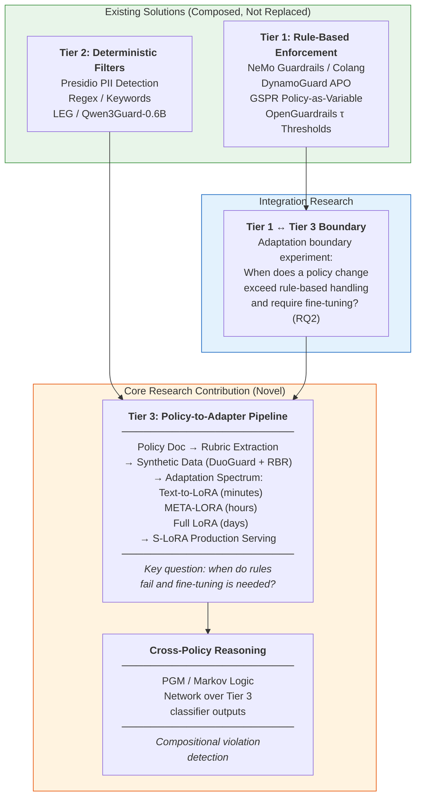
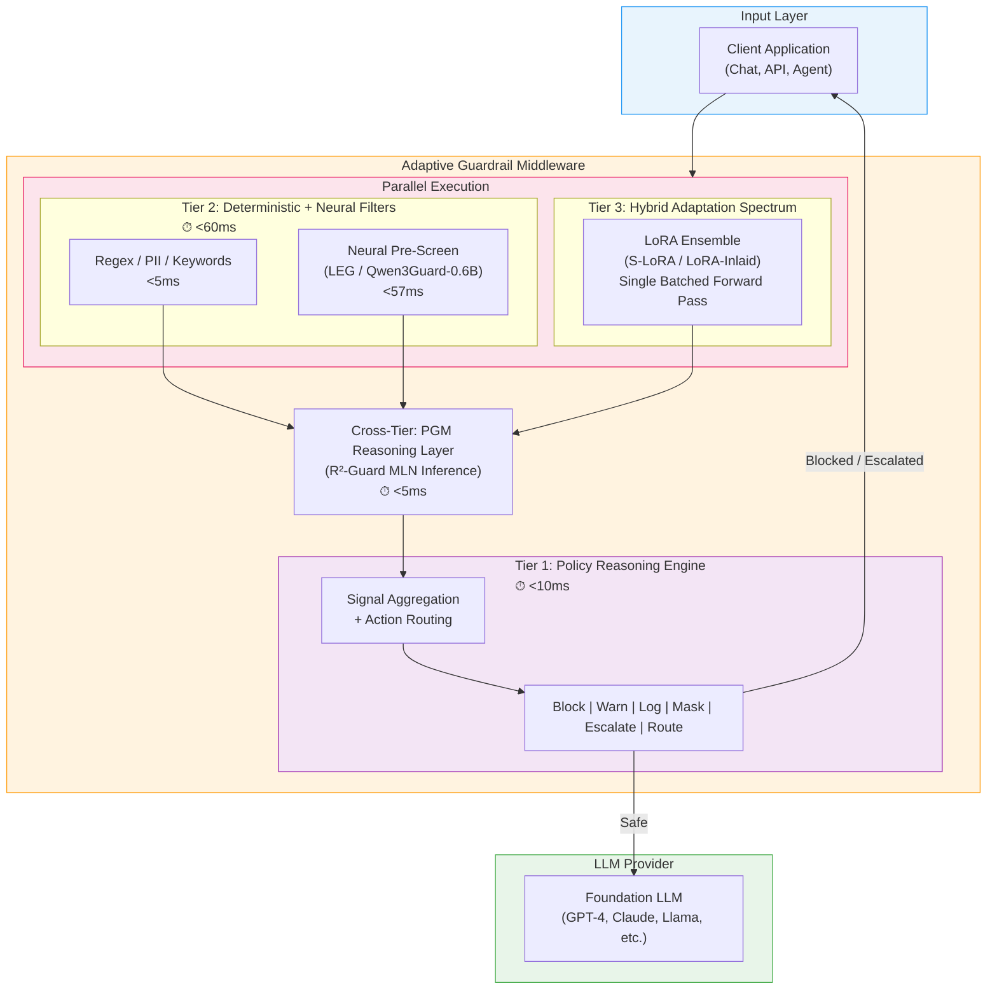
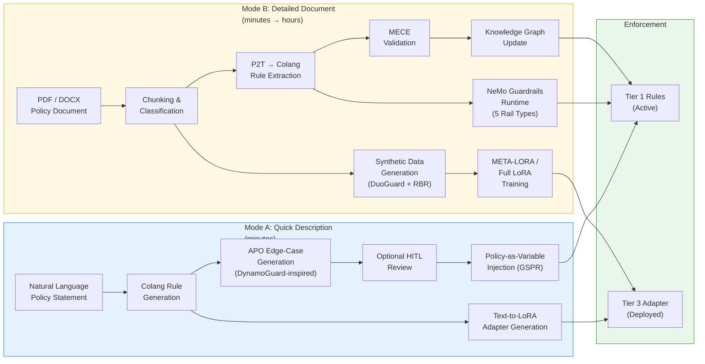
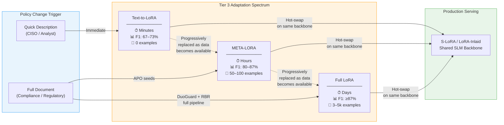
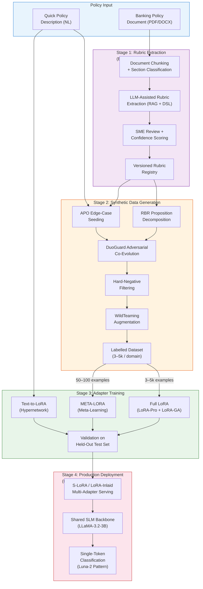
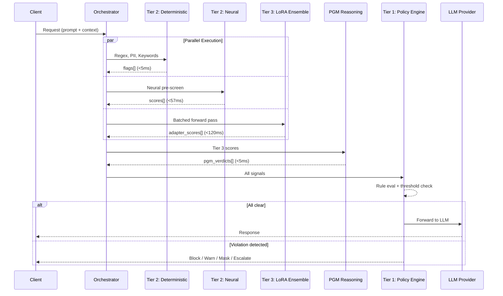
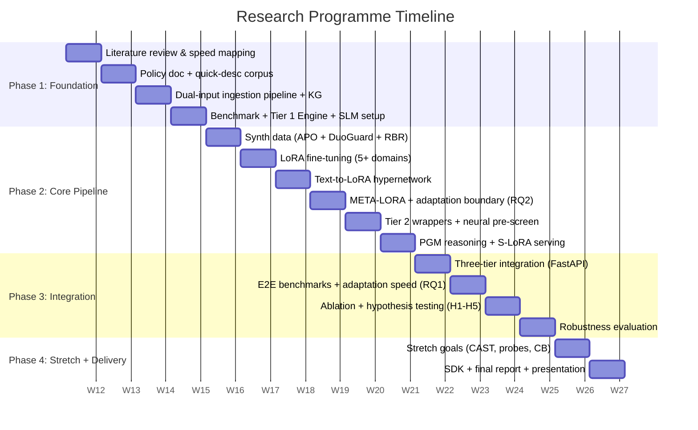

**RESEARCH PROPOSAL**

**Adaptive Policy-Driven LLM Guardrails for Financial Banking**

*A Three-Tier Architecture with Document-Driven Policy Reasoning, Hybrid Adapter Strategies, and Cross-Policy Logical Inference*

| Classification: | Internal – Confidential |
| :---- | :---- |
| **Status:** | Draft v4.0 (Revised) |
| **Date:** | March 2026 |
| **Timeline:** | 16 Weeks |
| **Division:** | AI / ML Research & Development |
| **Key References:** | Luna-2, OneShield, OpenGuardrails, Wildflare GuardRail, R²-Guard, Text-to-LoRA, CourtGuard, DuoGuard, DynamoGuard, PrimeGuard, CAST, GuardReasoner |

---

# TL;DR

**The problem:** Banks deploying LLMs need guardrails that adapt as fast as policies and threats change. Today, translating a new regulation or threat into an enforced guardrail takes weeks. We call this the *adaptation gap*.

**What already exists:** Tier 1 (rule-based policy enforcement) and Tier 2 (deterministic filters) are largely solved by existing tools — NeMo Guardrails provides programmable Colang rails, DynamoGuard provides natural-language policy definition with APO, Presidio handles PII detection, and lightweight neural classifiers (LEG, Qwen3Guard) provide fast semantic pre-screening. These are mature, deployable, and we do not aim to replace them.

**The gap this research fills:** No existing system can automatically take a banking policy document and produce a fine-tuned, domain-specific neural classifier that enforces it with high precision. This is the Tier 3 problem — and specifically, the **automated fine-tuning pipeline** that converts policy documents into production-ready LoRA adapters on a shared SLM backbone. The research contribution is:

1. **An end-to-end policy-to-adapter pipeline:** Policy document → automated rubric extraction → synthetic data generation (DuoGuard adversarial co-evolution + RBR proposition decomposition) → LoRA fine-tuning with a spectrum of speed/precision trade-offs (Text-to-LoRA in minutes, META-LORA in hours, full LoRA in days).
2. **Empirical characterisation of the adaptation boundary:** At what point does a policy change exceed what rules and thresholds can handle and require a fine-tuned neural classifier? This is the key research question.
3. **Cross-policy reasoning via PGM:** A probabilistic graphical model that reasons over multiple fine-tuned classifier outputs jointly, catching compositional violations that individual classifiers miss.

**The three-tier architecture is a reference integration pattern**, not a monolithic system. Each tier is designed to interoperate with existing solutions. The research prototype demonstrates how the fine-tuning pipeline (Tier 3) plugs into whatever Tier 1 and Tier 2 infrastructure a bank already has.

**Deliverables (16 weeks):**

- Working policy-to-adapter pipeline: policy doc → rubrics → synthetic data → LoRA heads (5+ banking domains, F1 ≥ 0.87).
- Hybrid adaptation spectrum: Text-to-LoRA (zero-shot, minutes), META-LORA (few-shot, hours), full LoRA (days) — benchmarked on the same domains.
- Adaptation boundary analysis: empirical documentation of when Tier 1 rules suffice vs. when fine-tuning is needed.
- Cross-policy PGM reasoning layer with compositional violation detection.
- End-to-end prototype (FastAPI middleware) with p95 latency < 200ms.
- Python SDK, benchmark report, and production deployment roadmap.

---

# 1. Executive Summary

Large Language Models are being adopted across banking for customer support, document summarisation, knowledge retrieval, and regulatory reporting. Deploying LLMs in a regulated financial environment introduces compliance, reputational, and operational risk: models can hallucinate, leak sensitive data, produce advice that contravenes regulations, or violate internal policies on fair lending, KYC/AML, and data handling.

The core operational challenge is not building guardrails, but keeping them current. The security threat landscape shifts daily with new prompt injection techniques, jailbreak vectors, and adversarial strategies. Internal policies update quarterly or in response to regulatory changes. A guardrail system that takes weeks to adapt to a new policy or threat is a guardrail system that leaves the organisation exposed. We call this the *adaptation gap*.

Existing tools address parts of this problem well. NeMo Guardrails provides programmable, rule-based rails via Colang. DynamoGuard enables natural-language policy definition with edge-case generation. Presidio handles PII detection. Lightweight neural classifiers like LEG (<57ms) and Qwen3Guard-0.6B provide fast semantic pre-screening. **What no existing system provides is the automated pipeline that takes a banking policy document and produces a fine-tuned, domain-specific neural classifier that enforces it with high precision.** Rule-based systems cannot capture the nuanced, context-dependent judgments required for compliance domains like fair lending, investment suitability, or AML — these require learned representations. The question is how fast those representations can be built.

This proposal outlines a **16-week research programme** focused on solving this fine-tuning gap. The primary research contribution is a **policy-to-adapter pipeline** that automates the journey from policy document to deployed neural classifier, with a spectrum of speed/precision trade-offs:

- **Tier 3 – Hybrid Adaptation Spectrum (core research contribution):** An automated pipeline that converts policy documents into fine-tuned LoRA adapters on a shared SLM backbone. The pipeline supports three mechanisms at different points on the speed/precision frontier: Text-to-LoRA generates adapters from policy descriptions in a single forward pass with zero labelled data (ICML 2025, arXiv:2506.06105). META-LORA trains from 50–100 examples via meta-learning (arXiv:2510.11598). Full LoRA fine-tuning with DuoGuard adversarial data generation handles precision-critical domains (arXiv:2502.05163). S-LoRA and LoRA-Inlaid enable production serving of dozens of concurrent adapters. **The key research question is empirically characterising the boundary between what rules can handle and what requires fine-tuning.**

- **Cross-Tier Reasoning Layer (secondary research contribution):** R²-Guard's probabilistic graphical model (PGM) reasoning encodes cross-policy compliance logic on top of the fine-tuned classifiers, capturing compositional violations (e.g., "financial advice + no disclaimer + retail customer") that individual classifiers miss (ICLR 2025 Spotlight, arXiv:2407.05557).

The research is framed within a three-tier reference architecture that is **designed to compose with, not replace, existing guardrail infrastructure:**

- **Tier 1 – Policy Reasoning Engine (existing solutions + integration):** Rule-based enforcement via NeMo Guardrails / Colang, DynamoGuard-style APO edge-case generation, GSPR policy-as-variable inference. Supports dual-input ingestion: quick natural-language descriptions (minutes) and full document compilation via P2T (minutes to hours). *This tier uses existing tooling; our contribution is the automated policy ingestion pipeline that feeds it.*

- **Tier 2 – Deterministic + Lightweight Neural Filters (existing solutions + evaluation):** Presidio PII detection, regex/keyword filters, plus LEG or Qwen3Guard-0.6B as a lightweight neural pre-screen. *This tier is composed from existing components; our contribution is benchmarking their effectiveness on banking-specific compliance tasks and quantifying the incremental value of neural pre-screening.*

The system maintains a **gradient of deployment speed versus classification precision** — from zero-shot policy enforcement for new regulations (minutes) through few-shot adapter composition (hours) to fully fine-tuned classifiers for high-stakes categories (days) — all on the same SLM backbone. This gradient is precisely what banking compliance requires in a rapidly evolving regulatory environment.

The deliverable is a working prototype, benchmark results across all tiers and their compositions, empirical characterisation of the adaptation boundary, and a recommendation on optimal tier allocation for production deployment.

---

# 2. Problem Statement

## 2.1 The Adaptation Gap

Financial institutions operate under dense, overlapping regulatory regimes (FCA, PRA, OCC, FINRA, GDPR, DORA). Policy documents run to hundreds of pages and are updated quarterly. Meanwhile, the adversarial threat landscape changes on a daily cadence: new jailbreak techniques, novel prompt injection vectors, and evolving social engineering strategies emerge constantly. The fundamental problem is not building a guardrail; it is building a guardrail that can adapt at the speed of the threats it is designed to stop.

Today, translating a policy change into an enforced guardrail rule is a manual, multi-week process: read the updated policy, identify new requirements, author rules or retrain models, test, and deploy. During this lag, the LLM is unprotected against the new risk. We call this the **adaptation gap**.

## 2.2 The LLM Risk Surface

- **Compliance violations** – responses contradicting regulatory requirements (e.g., investment advice without disclaimers).
- **Data leakage** – outputs exposing PII, account numbers, or internal-only information.
- **Hallucinated authority** – fabricated policy references, regulatory citations, or product terms.
- **Bias and fairness** – responses violating fair lending rules or exhibiting discriminatory patterns.
- **Prompt injection and jailbreaking** – adversarial inputs designed to bypass system instructions.
- **Emerging threats** – new attack vectors (indirect prompt injection via retrieved documents, multi-turn crescendo attacks, covert malicious fine-tuning) that did not exist when the guardrail was built.

## 2.3 Why Existing Approaches Fall Short

Current guardrail solutions each solve part of the problem but leave adaptation gaps:

| Approach | Strengths | Adaptation Gap |
| :---- | :---- | :---- |
| **OneShield (IBM)** | Model-agnostic, parallel detectors, Policy Manager with action routing, low-latency (<0.5ms PII). | BERT-based classifiers require large labelled datasets and retraining. No mechanism to auto-generate detectors from policy docs. |
| **NeMo Guardrails (NVIDIA)** | Open-source programmable rails via Colang DSL. Five rail types (input, dialog, retrieval, execution, output). Event-driven architecture with parallel rail execution. KNN-based semantic matching for canonical forms. Colang 2.0 supports concurrent flows and multi-modal interactions. P2T pipeline outputs Colang snippets directly. | Rule-based nature limits flexibility for nuanced semantic violations. KNN effectiveness tied to quality and coverage of canonical form definitions. Manual Colang authoring bottleneck — no automated policy-to-Colang pipeline. Latency overhead can triple base application cost (NVIDIA's own benchmarks). No fine-tuned neural classifiers for domain-specific compliance. |
| **OpenGuardrails** | Configurable per-request policies, continuous sensitivity thresholding (τ), unified LLM guard, 119 languages, GPTQ quantisation. | Single unified model; adding a new policy category requires retraining the full guard model. No policy document ingestion. |
| **Wildflare GuardRail** | Modular pipeline (detection + grounding + customiser + repairer), explainable hallucination detection, lightweight wrappers. | Wrappers handle syntactic patterns only. Semantic policy enforcement still requires model retraining. |
| **Luna-2 (Galileo)** | Single-token classification via LoRA heads on shared SLM backbone. 80x cheaper, 20x faster than LLMAJ. Multi-tenant serving. | LoRA heads trained on generic metrics. No pipeline for org-specific policy domains. No Policy Manager layer. |
| **R²-Guard** | Category classifiers + PGM reasoning. +12.6% over Llama Guard, +59.9% against jailbreaks. | No policy ingestion pipeline. PGM rules authored manually. |
| **CourtGuard** | Zero-shot policy-grounded reasoning via multi-agent RAG. 90% accuracy on OOD tasks by swapping documents. | Multi-agent inference latency (seconds). No fine-tuned precision for high-stakes categories. |
| **GuardReasoner** | Chain-of-thought reasoning with audit-ready explanations. 8B variant surpasses GPT-4o+CoT by 5.74% F1. | Large model footprint. No configurable policy adaptation. |
| **DynamoGuard (Dynamo AI)** | Natural-language policy definition via APO (Automatic Policy Optimization). Edge-case generation + HITL review + lightweight guard model fine-tuning. 2–3× improvement in violation detection. Enterprise monitoring dashboard. | Proprietary platform; APO technique not published as open research. No multi-tier architecture or cross-policy reasoning. No adaptation speed benchmarks. |
| **PrimeGuard (Dynamo AI)** | Tuning-free routing that overcomes the "guardrail tax" (safety vs. helpfulness). Safe responses 61%→97%, attack success rate 100%→8%. No fine-tuning required. ICML 2024. | Routing overhead adds latency (multiple LM passes). No policy-specific customisation beyond prompt instructions. Not designed for compliance classification. |
| **DuoGuard** | Adversarial co-evolution produces 0.5B model outperforming LlamaGuard3 (8B) by ~10% F1. | No policy-specific customisation. |

No existing system provides the complete pipeline: **policy document ingestion → automatic rule generation → multi-mechanism enforcement with adaptation speeds ranging from minutes to days → cross-policy logical reasoning**. NeMo Guardrails provides the most mature programmable rail framework via Colang, and P2T can compile policy documents into Colang snippets — but NeMo lacks neural classifiers for nuanced semantic violations and has no mechanism to auto-generate Colang rules from policy documents end-to-end. DynamoGuard comes closest on the policy-to-guardrail workflow (natural-language policies → edge-case generation → fine-tuned model), but lacks multi-tier architecture, cross-policy reasoning, and the hybrid adapter spectrum that allows different precision/speed trade-offs per policy domain. PrimeGuard's routing approach addresses the safety-helpfulness trade-off but operates at the response-generation level rather than as a compliance classification system. This research bridges these gaps: it adopts Colang-compatible rule output from P2T-style policy ingestion, adds neural classification via the LoRA ensemble and lightweight pre-screen, layers PGM reasoning on top, and wraps the full system in a dual-input interface for both rapid threat response and comprehensive regulatory ingestion.

## 2.4 Core Research Hypotheses

The research is organised around five testable hypotheses, each derived from the literature and designed with clear falsification criteria.

**H1 (Dual-Input Policy Adaptation):** A policy reasoning engine supporting two ingestion modes — (a) quick natural-language descriptions with APO-style edge-case generation (DynamoGuard-inspired) and GSPR-style policy-as-variable injection, and (b) full document compilation via P2T pipelines (arXiv:2512.04408) — can absorb new compliance requirements within minutes (Mode A) to hours (Mode B), achieving ≥80% rule extraction accuracy (SME-validated) without code changes or model retraining.

*Falsification:* Quick-description mode exceeds 10 minutes to enforcement, or full-document extraction accuracy falls below 70% on held-out policy documents, or the full-document pipeline exceeds 30 minutes.

**H2 (Lightweight Neural Pre-Screen):** Adding a sub-1B neural classifier (LEG or Qwen3Guard-0.6B) to the deterministic filter tier catches ≥15% more semantic violations than regex/keyword filters alone, while keeping Tier 2 p95 latency under 60ms.

*Falsification:* The neural pre-screen adds <5% incremental detection, or p95 latency exceeds 100ms.

**H3 (Hybrid Adaptation Spectrum):** A spectrum of adapter strategies — Text-to-LoRA (zero-shot), META-LORA (50–100 examples), and full LoRA (3–5k examples) — provides a measurable gradient of deployment speed versus F1, where the optimal mechanism is predictable from policy complexity and available training data.

*Falsification:* Text-to-LoRA adapters achieve <55% F1 on banking policy domains, or META-LORA shows no improvement over Text-to-LoRA despite labelled examples.

**H4 (Cross-Policy Reasoning):** A probabilistic graphical model layer encoding compliance logic over Tier 3 classifier outputs detects ≥10% more compositional violations (e.g., "financial advice + no disclaimer + retail customer") than flat per-category classification.

*Falsification:* PGM reasoning adds <3% incremental detection over independent classifiers.

**H5 (Adversarial Synthetic Data):** APO-seeded edge-case generation (DynamoGuard-inspired), DuoGuard-style adversarial co-evolution, and RBR-style proposition-based decomposition produce training data that yields ≥5% higher F1 than naive LLM-generated pairs on held-out compliance benchmarks.

*Falsification:* Adversarial data shows no significant improvement over naive generation.

## 2.5 Derived Research Questions

**RQ1:** *Can the composed three-tier system maintain F1 ≥ 0.87 and p95 latency < 200ms across ≥5 banking policy domains?*

**RQ2:** *What is the empirical boundary between policy changes absorbable by Tier 1 (document ingestion) versus those requiring Tier 3 (adapter retraining), and can this boundary be predicted from policy complexity metrics?*

**RQ3:** *What is the minimum data requirement per policy domain at each point on the adaptation spectrum (zero-shot, few-shot, full fine-tuning)?*

---

# 3. Proposed Architecture

The system is a three-tier adaptive guardrail with a cross-tier reasoning layer, operating as middleware between the client application and the LLM provider. Each tier operates at a different adaptation speed and precision level.

**Composability principle:** The three-tier architecture is a reference integration pattern. Each tier is designed as a modular component that can interoperate with existing guardrail infrastructure. A bank that already uses NeMo Guardrails for Tier 1 and Presidio for Tier 2 can adopt the Tier 3 fine-tuning pipeline without replacing their existing stack. The research focuses on the components marked as **novel** below — the fine-tuning pipeline and cross-policy reasoning — while composing with existing solutions for rule-based enforcement and deterministic filtering.

### Figure 1: Research Scope — What's New vs. What's Existing

| Tier | Mechanism | Adaptation Speed | What It Handles | Key References |
| :---- | :---- | :---- | :---- | :---- |
| **Tier 1: Policy Reasoning Engine** | Document-driven rule compilation (Colang-compatible), policy-as-variable inference, configurable thresholds and action routing. | **Minutes** | New regulations, threshold adjustments, category toggles, jurisdiction-specific rules, action routing. | P2T (arXiv:2512.04408), NeMo Guardrails / Colang 2.0 (arXiv:2310.10501), CourtGuard (arXiv:2602.22557), GSPR (arXiv:2509.24418), OpenGuardrails (τ thresholding), OneShield (Policy Manager). |
| **Tier 2: Deterministic + Neural Filters** | Regex, PII detection (Presidio), blocked-term lists, injection patterns, plus lightweight neural pre-screen. | **Hours** | PII formats, injection patterns, blocked terms, disclaimer insertion, semantic pre-screening. | Wildflare GuardRail (Customizer), OneShield (extractors), LEG (arXiv:2602.15853), Qwen3Guard (arXiv:2510.14276), "No Free Lunch" (arXiv:2504.00441). |
| **Tier 3: Hybrid Adaptation Spectrum** | Per-policy adapter selection: Text-to-LoRA (zero-shot), META-LORA (few-shot), full LoRA (precision-critical). Served via S-LoRA/LoRA-Inlaid. | **Hours–Days** | New compliance domains, semantic policy shifts, context adherence, hallucination detection, fair lending. | Luna-2 (arXiv:2602.18583), Text-to-LoRA (arXiv:2506.06105), META-LORA (arXiv:2510.11598), S-LoRA (MLSys 2024), LoRA-Inlaid (NeurIPS 2024). |
| **Cross-Tier: Reasoning Layer** | PGM-based logical inference over Tier 3 classifier outputs. Markov Logic Networks encode compliance rules as first-order logic. | **Minutes** (rule edits) | Compositional violations, cross-policy dependencies, escalation logic. | R²-Guard (arXiv:2407.05557), RBR (arXiv:2411.01111). |

### Figure 2: High-Level Architecture Overview

## 3.1 Tier 1 – Policy Reasoning Engine (Existing Solutions + Integration Research)

Tier 1 composes existing rule-based guardrail infrastructure. The research contribution here is not the enforcement mechanism itself — NeMo Guardrails, DynamoGuard, and GSPR already handle this — but rather the **automated dual-input ingestion pipeline** that feeds policy documents into these systems, and the **adaptation boundary experiment** (RQ2) that empirically determines when Tier 1 rules are sufficient versus when Tier 3 fine-tuning is needed.

### 3.1.1 Dual-Input Policy Ingestion

A key operational insight: not all policy changes arrive as formal documents. A CISO may need to block a new jailbreak vector within minutes based on a Slack message. A compliance officer may need to enforce a new SEC rule from a 200-page PDF. The system must handle both.

**Mode A — Quick Description (minutes).** A natural-language policy statement such as *"Block any response that provides specific stock price predictions"* or *"Flag all outputs that reference internal project codenames."* The statement is parsed into a structured rule via a Colang-compatible DSL (leveraging NeMo Guardrails' established syntax for defining dialogue flows and rails), optionally expanded into edge-case examples using DynamoGuard-style Automatic Policy Optimization (APO) (Dynamo AI), and injected as a policy-as-variable (GSPR pattern) for immediate enforcement. If an adapter is needed, Text-to-LoRA generates one from the description in a single forward pass.

**Mode B — Detailed Document (minutes to hours).** A full PDF/DOCX policy document (compliance manual, risk framework, regulatory release). The P2T pipeline compiles the document into machine-readable rules; the regulatory knowledge graph is incrementally updated; and LoRA adapters are trained or composed for precision-critical domains.

### Figure 3: Dual-Input Policy Ingestion Pipeline

Both modes feed into the same enforcement infrastructure and can be used in combination — a quick description provides immediate coverage while a detailed document pipeline runs in the background to produce higher-precision rules and adapters.

### 3.1.2 Automated Document Ingestion (Mode B Detail)

**Policy-to-Rules compilation:** Following the P2T pipeline (arXiv:2512.04408, AAAI 2026 Workshop), regulatory documents are compiled into machine-readable rules via a compact domain-specific language. P2T explicitly supports output as NeMo Colang snippets, Guardrails AI validators, and OPA/Rego policies — providing direct integration paths with existing guardrail tooling. We adopt Colang 2.0 as the primary rule representation, leveraging its event-driven execution model, parallel flow support, and pythonic syntax. Each extracted rule encodes hazards, scope, conditions, exceptions, and provenance, retaining a traceable link to its source paragraph for audit purposes.

**NeMo Guardrails integration:** Extracted Colang rules are executable within the NeMo Guardrails runtime, providing five rail types that map naturally to our architecture: **input rails** (Tier 2 pre-filtering), **dialog rails** (Tier 1 policy-driven conversation control), **retrieval rails** (RAG-time document filtering), **execution rails** (action-level guardrails for agentic use cases), and **output rails** (Tier 2 post-filtering). NeMo's parallel rail execution validates our design of running Tier 2 and Tier 3 concurrently. However, NeMo's rule-based approach is insufficient for nuanced semantic violations — this is precisely where our Tier 3 neural classifiers and cross-tier PGM reasoning supplement it.

**Regulatory knowledge graph:** Following RAGulating Compliance (arXiv:2508.09893), the system maintains a knowledge graph of regulatory triplets (subject–predicate–object). When a new banking regulation is published, the system extracts new triplets and incrementally updates the graph — no full rebuild required. PrivComp-KG (arXiv:2404.19744) validates this approach, achieving a correctness score of 0.9 on privacy regulations.

**MECE rule guarantees:** Following the Brain Co. Rules Engine approach, extracted rules are validated for Mutually Exclusive, Collectively Exhaustive coverage, reducing ambiguity-driven regulatory risk.

### 3.1.3 APO-Assisted Edge-Case Generation (Mode A Detail)

Inspired by DynamoGuard's Automatic Policy Optimization (Dynamo AI), the quick-description path automatically generates edge-case examples from the natural-language policy statement. Given a rule like *"do not recommend specific securities to retail customers,"* APO produces a diverse set of compliant, non-compliant, and borderline interactions. These serve two purposes: (a) immediate few-shot examples for policy-as-variable enforcement, and (b) seed training data if a LoRA adapter is later trained for this domain. An optional human-in-the-loop step allows compliance teams to review, edit, or reject generated edge cases before enforcement — following DynamoGuard's enterprise workflow pattern.

### 3.1.4 Policy-as-Variable Inference

Following GSPR (arXiv:2509.24418), compiled policy rules are injected as instructional prompt variables to the guard model at inference time. New banking policies are specified as text configurations enforceable without retraining. This is validated by GSPR achieving SOTA safety prediction with the lowest inference token cost.

### 3.1.5 Configuration and Action Routing

The engine retains the configuration capabilities of the v3 Policy Manager, enhanced with PrimeGuard-inspired routing:

- **Per-domain threshold (τ):** Continuous sensitivity parameter per policy domain, following OpenGuardrails' approach. Adjustable at runtime via API.
- **Category toggles:** Enable/disable any policy domain without touching the model.
- **Severity-aware action routing:** Map each (domain, severity) pair to an action: block, warn with explanation, log for audit, mask sensitive content, or escalate to human review. Follows OneShield's decoupled detection/action design.
- **PrimeGuard-style response routing:** For borderline cases, following PrimeGuard's structured control flow (Manczak et al., arXiv:2407.16318, ICML 2024), requests can be routed to different LLM instances with tailored system prompts — a strict-compliance instance for high-risk domains and a standard instance for low-risk queries. PrimeGuard demonstrates this overcomes the "guardrail tax" (safety vs. helpfulness trade-off), improving safe responses from 61% to 97% while maintaining helpfulness scores.
- **Jurisdictional templates:** Pre-configured policy profiles for GDPR, CCPA, FCA, PRA, etc.

**Net effect:** When a CISO identifies a new threat, they type a quick description and enforcement begins within minutes. When a compliance officer receives a new FCA directive, they upload the PDF and the full pipeline runs. Both paths produce auditable, versioned rules.

## 3.2 Tier 2 – Deterministic + Lightweight Neural Filters (Existing Solutions + Evaluation)

Tier 2 is composed from existing, production-ready components. The research contribution here is **benchmarking their effectiveness on banking-specific compliance tasks** and quantifying the incremental value of adding a lightweight neural pre-screen to deterministic filters (H2).

### 3.2.1 Deterministic Filters (Retained)

- **PII detection:** Presidio-based entity extraction with custom recognisers for banking-specific patterns (account numbers, SWIFT codes, sort codes).
- **Blocked-term lists:** Version-controlled config for sanctioned entities, prohibited product names.
- **Injection pattern matching:** Known prompt injection signatures as regex rules.
- **Disclaimer injection:** Automatically append required disclaimers based on domain classification.

All deterministic filters run in parallel, typically completing in <5ms.

### 3.2.2 Lightweight Neural Pre-Screen (New)

The "No Free Lunch With Guardrails" paper (arXiv:2504.00441) formally validates that different guardrail mechanisms operate at distinct latency tiers: regex at microseconds, neural classifiers at 10s–100s of milliseconds, and LLM-as-judge at seconds. This confirms that a lightweight neural classifier in Tier 2 is architecturally sound.

Two candidate models, evaluated during Phase 2:

- **LEG** (arXiv:2602.15853): Lightweight Explainable Guardrail with under 57ms latency. Produces word-level attribution showing exactly which tokens triggered classification. Achieves 69.98% F1 on WildGuardMix, outperforming the OpenAI Moderation API.
- **Qwen3Guard-0.6B** (arXiv:2510.14276): 0.6B variant rivals 7–8B guard models. Dual Strict/Loose modes map to banking needs: strict for customer-facing advice, loose for internal queries.

The neural pre-screen runs in parallel with deterministic filters. Its output feeds into the Tier 1 reasoning engine as an additional signal. This catches semantic violations (e.g., subtly misleading financial advice) that regex cannot detect, at a latency cost well within the overall budget.

## 3.3 Tier 3 – Hybrid Adaptation Spectrum (Core Research Contribution)

**This is the primary focus of the research.** No existing guardrail system provides an automated pipeline that takes a banking policy document and produces a fine-tuned, domain-specific neural classifier. Rule-based systems (NeMo Colang, GSPR) cannot capture nuanced, context-dependent compliance judgments — a fair lending violation, a subtly misleading investment recommendation, or an insufficiently documented suitability assessment require learned representations, not pattern matching. The question is: how fast can those representations be built, and how little data do they need?

Rather than a single fine-tuning mechanism, the system maintains a **spectrum of adapter strategies**, selecting the optimal approach per policy domain based on available data, required precision, and deployment urgency.

### 3.3.1 The Adaptation Spectrum

| Strategy | Data Required | Deployment Speed | Expected F1 | When to Use |
| :---- | :---- | :---- | :---- | :---- |
| **Text-to-LoRA** (arXiv:2506.06105) | Zero examples — natural-language policy description only. | **Minutes** (single forward pass through hypernetwork). | 67–73% (based on T2L benchmarks) | Rapid deployment of new policies. Acceptable when immediate coverage matters more than peak precision. |
| **META-LORA** (arXiv:2510.11598) | 50–100 labelled examples per policy. | **Hours** (few-shot fine-tuning on meta-initialised adapter). | 80–87% (projected from META-LORA benchmarks on LLaMA-scale models) | Policies where some labelled data is available or can be quickly generated. Balances speed and precision. |
| **Full LoRA Fine-Tuning** | 3–5k examples per domain (Luna-2 recipe). | **Days** (synthetic data generation + training + validation). | ≥87% (Luna-2 validated) | Precision-critical, high-stakes categories (AML, fair lending, investment suitability). |

This gradient means that when a new SEC rule is published, the system can enforce it immediately via Text-to-LoRA, improve accuracy within hours via META-LORA as initial labelled data is generated, and reach full precision within days via complete fine-tuning — all on the same SLM backbone.

### Figure 4: Adaptation Spectrum — Progressive Refinement per Policy

### 3.3.2 Hypernetwork Meta-Training (Text-to-LoRA)

Text-to-LoRA (Sakana AI, ICML 2025) trains a hypernetwork that generates task-specific LoRA adapters from natural-language task descriptions. Across nine benchmarks, T2L-generated adapters match manually trained LoRA and achieve 67.7% zero-shot accuracy on held-out tasks. The upfront cost is meta-training across hundreds of adapter tasks; we propose meta-training on a corpus of compliance classification tasks derived from public regulatory datasets and open-source banking benchmarks.

### 3.3.3 Few-Shot Meta-Learning (META-LORA)

META-LORA (arXiv:2510.11598) applies MAML-inspired two-stage meta-learning: a shared meta-adapter captures cross-task knowledge, enabling new policy classifiers from 50–100 labelled examples. For banking, patterns learned from existing compliance categories (KYC, AML, fair lending) transfer to new categories (new ESG disclosure requirements, updated consumer duty rules).

### 3.3.4 Full LoRA Fine-Tuning (Precision-Critical Domains)

Following Luna-2's architecture: policy-specific LoRA heads on a shared SLM backbone (LLaMA-3.2-3B or Qwen-3B), each performing single-token binary classification. Training enhancements over v3:

- **LoRA-Pro** (ICLR 2025): Aligns low-rank gradient updates with full fine-tuning via closed-form solution. +15.49 on GSM8K over standard LoRA.
- **LoRA-GA** (NeurIPS 2024): Initialises LoRA matrices using initial gradient direction, ensuring training starts aligned with the optimal trajectory.
- **CE-LoRA** (arXiv:2502.01378): 3.39× computation acceleration through approximate matrix multiplication during backpropagation.

LoRA config: rank r=16, α=16, applied to attention projections. Training: AdamW, 3–5 epochs. Loss: cross-entropy over conditional class token probabilities (Luna-2 Eq. 1). Target: 3–5k examples per binary domain.

### 3.3.5 Synthetic Data Generation (Upgraded)

The v3 approach (LLM-generated pairs + targeted corruption) is replaced by three more principled methods:

**DynamoGuard-style APO seeding** (Dynamo AI): For each policy domain, Automatic Policy Optimization generates edge-case examples from the natural-language policy description. Compliance teams review and refine these via a human-in-the-loop workflow. DynamoGuard reports 2–3× improvement in violation detection accuracy through this approach. APO-generated examples serve as high-quality seeds for the adversarial pipeline below.

**DuoGuard-style adversarial co-evolution** (arXiv:2502.05163): A generator and classifier co-evolve adversarially. The generator produces synthetic violations, the classifier trains on them, and misclassified examples (hard negatives) are fed back. DuoGuard's 0.5B model outperforms LlamaGuard3 (8B) by ~10% F1 using this approach. The key insight: filtering to only misclassified examples yields significant improvements; including all generated data shows negligible gains.

**RBR-style proposition decomposition** (NeurIPS 2024, arXiv:2411.01111): Each banking policy is decomposed into individual binary propositions ("does this response disclose restricted account information?"), evaluated by LLM graders, and combined into a composite label. RBR achieves F1 of 97.1 vs. 91.7 for human-feedback baselines.

**WildTeaming augmentation** (NeurIPS 2024, arXiv:2406.18510): Mines jailbreak tactic clusters and composes multiple tactics for diverse adversarial examples. Contrastive pairs (harmful + benign-that-resembles-harmful) prevent over-refusal of legitimate financial queries.

**Critical design choice** (Wang et al., 2025, arXiv:2504.02193): Use single-model generation. Multi-model pipelines create linearly separable preferences that models exploit as shortcuts.

### 3.3.6 Production Serving

- **S-LoRA** (MLSys 2024): Unified paging memory management and custom CUDA kernels. Up to 30× throughput over HuggingFace PEFT, serving thousands of concurrent adapters on a single GPU.
- **LoRA-Inlaid** (NeurIPS 2024): Inlays multiple adapters into a quantized base model. 1.58× throughput and 2× job completion time improvements over S-LoRA.

### 3.3.7 End-to-End Fine-Tuning Pipeline Summary

The complete pipeline — from policy document to production-deployed adapter — is the central research deliverable. The diagram below shows the full flow, with each stage representing a distinct engineering and research challenge.

### Figure 5: Policy-to-Adapter Fine-Tuning Pipeline (Core Research Deliverable)

**Key research questions at each stage:**
- **Stage 1:** Can LLM-assisted rubric extraction achieve ≥80% accuracy on banking policy documents? (H1)
- **Stage 2:** Does DuoGuard hard-negative filtering + RBR proposition decomposition yield ≥5% higher F1 than naive generation? (H5)
- **Stage 3:** What is the F1 gradient across the adaptation spectrum, and how few examples does each mechanism need? (H3, RQ3)
- **Stage 4:** Can multiple adapters serve concurrently on a single GPU with p95 < 120ms? (RQ1)

## 3.4 Cross-Tier Reasoning Layer (Secondary Research Contribution)

The second research contribution. Fine-tuned classifiers detect individual policy categories well, but banking compliance violations are often compositional — they arise from the *combination* of multiple categories, not any single one.

**R²-Guard** (ICLR 2025 Spotlight, arXiv:2407.05557) demonstrates that combining category-specific neural classifiers with probabilistic graphical model reasoning — Markov Logic Networks (MLNs) encoding safety rules as first-order logic — captures intercorrelations between categories that flat classification misses. R²-Guard surpasses Llama Guard by +12.6% on standard benchmarks and +59.9% against jailbreak attacks.

For banking, the PGM layer encodes compliance logic such as:

- "IF financial_advice AND NOT suitability_assessment AND retail_customer → ESCALATE"
- "IF transaction_amount > threshold AND NOT enhanced_due_diligence → BLOCK"
- "IF cross_border_transfer AND sanctioned_jurisdiction → BLOCK + ALERT"

Rules are expressed as weighted first-order logic clauses in the MLN. **New rules can be added by editing the graph — no retraining required.** The PGM operates over the calibrated probability outputs of Tier 3 classifiers, adding negligible latency (matrix operations over a small graph).

## 3.5 Inference Pipeline and Latency Budget

At inference time, the tiers execute as follows:

1. **Tier 2 filters** and **Tier 3 LoRA ensemble** run in parallel (following OneShield's pattern).
2. The **neural pre-screen** (Tier 2) runs concurrently with deterministic filters.
3. Tier 3 executes all relevant LoRA heads in a single batched forward pass on the shared backbone. Each head outputs a calibrated probability score.
4. The **Reasoning Layer** applies PGM inference over Tier 3 outputs.
5. **Tier 1 Policy Reasoning Engine** aggregates all signals — Tier 2 flags, Tier 3 scores, PGM outputs — and applies action routing.

No multi-token generation, no RAG retrieval, no chain-of-thought reasoning in the hot path. RAG is used only at build-time (policy ingestion).

| Layer | Budget (p95) | Runs | Notes |
| :---- | :---- | :---- | :---- |
| Tier 2: Deterministic filters | < 5 ms | Always, parallel | Regex, PII, keywords |
| Tier 2: Neural pre-screen | < 60 ms | Always, parallel | LEG or Qwen3Guard-0.6B |
| Tier 3: LoRA Ensemble | < 120 ms | Always, batched | Single forward pass, S-LoRA serving |
| Cross-Tier: PGM Reasoning | < 5 ms | Always | Small graph, matrix ops |
| Tier 1: Policy Reasoning Engine | < 10 ms | Always | Rule evaluation + action routing |
| **Total (worst case)** | **< 140 ms** | | **60 ms headroom to 200 ms target** |

### Figure 6: Inference-Time Execution Flow

---

# 4. Research Plan (16 Weeks)

## Phase 1: Foundation (Weeks 1–4)

**Objective:** Literature baseline, policy ingestion pipeline, evaluation framework, and Tier 1 Policy Reasoning Engine prototype.

1. **Literature baseline and adaptation speed mapping.** Catalogue adaptation speed (time from policy change to enforcement) for Luna-2, OneShield, OpenGuardrails, Wildflare GuardRail, R²-Guard, CourtGuard, GuardReasoner, DuoGuard, DynamoGuard, PrimeGuard, NeMo Guardrails, Llama Guard 3. Establish quantitative baselines.

2. **Policy document collection.** Collect 5–10 banking policy documents. Work with compliance SME to identify priority policy domains and define the domain taxonomy (target: 10–15 domains). Additionally, curate 20–30 quick-description policy statements covering common threat/policy update scenarios.

3. **Dual-input policy ingestion pipeline.** Build both ingestion modes: (a) Quick-description parser with Colang rule generation and APO-style edge-case expansion (inspired by DynamoGuard). (b) Full-document P2T pipeline: chunking → section classification → Colang rule extraction (leveraging P2T's native Colang output) → NeMo Guardrails runtime integration → regulatory knowledge graph construction (RAGulating Compliance pattern) → MECE validation. Validate extracted rules with compliance SME. Output: versioned rubric/rule registry v1.

4. **Evaluation benchmark design.** 500+ synthetic banking interactions (clean + violating), 100+ adversarial prompts (including HarmBench and WildTeaming attack types). Define metrics for all five hypotheses. Include separate benchmarks for quick-description vs. document-ingested policies.

5. **Tier 1 Policy Reasoning Engine v1.** Implement dual-input ingestion, policy-as-variable injection (GSPR pattern), configurable thresholds, category toggles, action routing (with PrimeGuard-style response routing for borderline cases), jurisdictional templates. Expose as REST API. Measure ingestion-to-enforcement time for both modes (H1 targets: quick description <5 min, full document <30 min).

6. **SLM backbone setup.** Set up LLaMA-3.2-3B and LoRA infrastructure. Validate Luna-2 training recipe on a generic metric (toxicity). Evaluate LoRA-Pro and LoRA-GA initialisations.

**Deliverable:** Rule registry v1, benchmark v1, Policy Reasoning Engine v1 with measured ingestion time, validated training infrastructure.

## Phase 2: Core Pipeline (Weeks 5–10)

**Objective:** Build all three tiers and the reasoning layer. Benchmark individually.

1. **Synthetic data generation pipeline.** Implement DuoGuard-style adversarial co-evolution and RBR proposition decomposition. Generate 3–5k examples per priority policy domain (KYC/AML, data handling, investment suitability, fair lending, complaints). Compare against naive generation (H5).

2. **Full LoRA fine-tuning.** Train LoRA heads for 5+ policy domains using Luna-2 recipe with LoRA-Pro/LoRA-GA enhancements. Measure per-head accuracy on held-out test sets. **Sample efficiency experiment:** how few examples per domain for F1 ≥ 0.87? (RQ3).

3. **Text-to-LoRA hypernetwork.** Meta-train the T2L hypernetwork on compliance classification task corpus. Evaluate zero-shot adapter generation for banking policy domains. Measure accuracy versus full LoRA (H3).

4. **META-LORA few-shot adapters.** Train meta-adapter on existing policy domains. Evaluate few-shot transfer to held-out domains with 50–100 examples. Characterise the accuracy/data trade-off across the full spectrum (H3).

5. **Tier 2 wrappers + neural pre-screen.** Build Presidio PII with banking-specific recognisers, blocked-term lists, injection pattern matching. Evaluate LEG and Qwen3Guard-0.6B as neural pre-screen candidates. Measure incremental detection and latency (H2).

6. **R²-Guard reasoning layer.** Implement PGM-based reasoning over Tier 3 classifier outputs. Define MLN rules for cross-policy compliance logic. Measure compositional violation detection (H4).

7. **Adaptation boundary experiment (RQ2).** Take trained LoRA heads, simulate policy changes of varying magnitude (shift rubrics progressively), and measure at what point Tier 1 rule ingestion suffices versus when Tier 3 adapter retraining becomes necessary. Define a policy complexity metric that predicts the boundary.

8. **LoRA ensemble serving.** Configure S-LoRA for multi-adapter serving on shared backbone. Measure multi-head latency on A100/H100. Evaluate LoRA-Inlaid for quantized deployment.

**Deliverable:** 5+ LoRA heads, Text-to-LoRA and META-LORA results, synthetic data pipeline, Tier 2 wrappers + neural pre-screen, PGM reasoning layer, individual benchmarks, adaptation boundary analysis, serving infrastructure.

## Phase 3: Integration and Evaluation (Weeks 11–14)

**Objective:** Compose the three-tier system, run end-to-end benchmarks, test all hypotheses.

1. **Three-tier integration.** Integrate all tiers into unified middleware (FastAPI). Implement orchestrator: Tier 2 (deterministic + neural) and Tier 3 (LoRA ensemble) run in parallel; PGM reasoning operates over Tier 3 outputs; Tier 1 aggregates and applies actions.

2. **End-to-end benchmarking.** Full evaluation benchmark through composed system. Measure accuracy (F1, precision, recall, FPR), latency (p50/p95/p99) at different τ configurations and adapter strategy selections. Validate RQ1 targets.

3. **Adaptation speed benchmark (RQ1).** Simulate change scenarios and measure wall-clock time-to-enforcement:
   - (a) Quick threat response: CISO types policy description → Tier 1 (Mode A) ingests → enforcement active. Target: <5 min.
   - (b) New regulation: upload policy PDF → Tier 1 (Mode B) ingests → enforcement active. Target: <30 min.
   - (c) New threat pattern: add injection regex + update neural pre-screen → Tier 2. Target: <4 hours.
   - (d) New high-stakes domain: generate data → train LoRA → deploy via S-LoRA → Tier 3. Target: <48 hours.
   - (e) Rapid adapter coverage: generate Text-to-LoRA adapter from policy description. Target: <1 hour.
   - (f) Progressive refinement: measure F1 trajectory as a policy moves from Mode A quick description → T2L adapter → META-LORA → full LoRA over time.

4. **Ablation study.** Measure accuracy/latency trade-offs for: Tier 2 only, Tier 3 only, Tier 2+3, Tier 2+3+PGM, full system. Quantify marginal contribution of each component.

5. **Hypothesis testing.** Formally evaluate H1–H5 against stated falsification criteria. Document results and confidence intervals.

6. **Robustness evaluation.** Test against HarmBench adversarial suite, multi-turn crescendo attacks, and indirect prompt injection via retrieved documents.

**Deliverable:** Integrated three-tier system, end-to-end benchmarks, adaptation speed results, ablation analysis, hypothesis test results, robustness evaluation.

## Phase 4: Stretch Goals, SDK, and Reporting (Weeks 15–16)

**Objective:** Exploratory experiments on high-risk/high-novelty ideas, SDK packaging, final report.

### 4.1 Exploratory Stretch Goals

These are high-novelty, higher-risk experiments informed by the literature. Each is scoped to 2–3 days of effort and evaluated on incremental value over the core system.

- **CAST activation steering** (IBM, ICLR 2025 Spotlight, arXiv:2409.05907): Program refusal rules by combining condition vectors (detecting topic) with behavior vectors (triggering refusal). No weight optimisation. Test whether 32–64 contrast pairs per policy domain achieve viable accuracy on banking compliance tasks. *Caveat:* Requires white-box model access; steering effects may fade over long generations.

- **Linear probes on model internals** (arXiv:2509.26238): Train single-layer classifiers on middle-to-late transformer hidden states. Test whether per-policy probes running on activations already computed during generation can match or approach LoRA adapter accuracy at negligible additional latency.

- **Circuit Breakers / RepBend** (NeurIPS 2024, arXiv:2406.04313; ACL 2025, arXiv:2504.01550): Apply representation rerouting to the base SLM to test whether a foundational safety layer reduces the burden on external guardrail tiers. Measure attack success rate reduction on HarmBench.

### 4.2 SDK and Documentation

- Package as Python SDK with decorator/wrapper pattern.
- Audit logging: every decision with triggering rule/tier, confidence score, latency, source policy reference.
- Integration guide and end-to-end demo.

### 4.3 Final Reporting

- Comprehensive benchmark report with all hypothesis results.
- Production roadmap with tier allocation recommendations.
- Stakeholder presentation.

**Deliverable:** Stretch goal experiment results, Python SDK, final benchmark report, production roadmap.

## 4.4 Week-by-Week Summary

| Wk | Phase | Activities | Key Output |
| :---- | :---- | :---- | :---- |
| 1 | 1 | Literature review; adaptation speed mapping (incl. DynamoGuard, PrimeGuard) | Survey document |
| 2 | 1 | Policy document collection + quick-description corpus curation; chunking pipeline | Raw corpus + pipeline |
| 3 | 1 | Dual-input ingestion: P2T rule extraction (Mode B) + quick-description parser with APO edge-case generation (Mode A); knowledge graph; MECE validation; SME review | Rule registry v1 |
| 4 | 1 | Benchmark dataset design; Tier 1 Policy Reasoning Engine v1 (both modes + PrimeGuard-style routing); SLM baseline validation | Benchmark v1 + Tier 1 v1 |
| 5 | 2 | Synthetic data pipeline (APO seeding + DuoGuard + RBR); begin LoRA fine-tuning | Data pipeline + first adapters |
| 6 | 2 | LoRA fine-tuning: 5+ domains; sample efficiency experiments | 5+ LoRA heads + RQ3 data |
| 7 | 2 | Text-to-LoRA hypernetwork meta-training | T2L prototype |
| 8 | 2 | META-LORA few-shot experiments; adaptation boundary experiment (RQ2) | H3 data + RQ2 analysis |
| 9 | 2 | Tier 2 wrappers + neural pre-screen evaluation (LEG vs Qwen3Guard) | Tier 2 complete + H2 data |
| 10 | 2 | R²-Guard PGM reasoning layer; S-LoRA ensemble serving | Reasoning layer + serving infra |
| 11 | 3 | Three-tier integration; unified middleware (FastAPI) | Integrated system |
| 12 | 3 | E2E benchmarking; adaptation speed benchmark (RQ1, both ingestion modes) | E2E + RQ1 results |
| 13 | 3 | Ablation study; hypothesis testing (H1–H5) | Ablation + hypothesis results |
| 14 | 3 | Robustness evaluation (HarmBench, crescendo attacks, indirect injection) | Robustness report |
| 15 | 4 | Stretch goals: CAST, linear probes, Circuit Breakers | Exploratory results |
| 16 | 4 | SDK packaging; final report; stakeholder presentation | Final deliverables |

### Figure 7: Research Timeline (16 Weeks)

---

# 5. Evaluation Framework

## 5.1 Accuracy and Latency Metrics

| Metric | Definition | Target | Priority |
| :---- | :---- | :---- | :---- |
| **Precision** | % flagged violations that are true violations | ≥ 90% | High |
| **Recall** | % actual violations detected | ≥ 85% | High |
| **F1 Score** | Harmonic mean of precision/recall | ≥ 87% | High |
| **False Positive Rate** | % clean inputs incorrectly blocked | ≤ 5% | Critical |
| **p95 Latency** | 95th percentile full guardrail check | < 140 ms | Critical |
| **p99 Latency** | 99th percentile full guardrail check | < 200 ms | Critical |
| **Rule Extraction Accuracy** | % rules correctly extracted from policy docs (SME-validated) | ≥ 80% | High |
| **Sample Efficiency** | Min examples per domain for F1 ≥ 0.87 (full LoRA) | < 5,000 | High |
| **Neural Pre-Screen Lift** | Incremental violation detection from Tier 2 neural classifier | ≥ 15% | Medium |

## 5.2 Adaptation Speed Metrics

| Metric | Definition | Target | Tier / Mode |
| :---- | :---- | :---- | :---- |
| **Quick-Description-to-Enforcement** | Time from natural-language policy statement to enforced rule (Mode A). | < 5 min | Tier 1 (Mode A) |
| **Document-to-Enforcement** | Time from new policy PDF upload to enforced rules in production (Mode B). | < 30 min | Tier 1 (Mode B) |
| **Pattern-to-Enforcement** | Time from new regex/keyword rule to enforced in production. | < 4 hours | Tier 2 |
| **Zero-Shot Adapter Deployment** | Time from policy description to deployed Text-to-LoRA adapter. | < 1 hour | Tier 3 (T2L) |
| **Few-Shot Adapter Deployment** | Time from 50–100 labelled examples (APO-seeded) to deployed META-LORA adapter. | < 8 hours | Tier 3 (META) |
| **Full Adapter Deployment** | Time from new policy document to deployed full LoRA head. | < 48 hours | Tier 3 (Full) |
| **Adaptation Boundary** | Max policy shift (measured as rule edit distance) absorbable by Tier 1 alone without F1 dropping below 0.87. | Documented | Tier 1 → 3 |

## 5.3 Hypothesis-Specific Metrics

| Hypothesis | Primary Metric | Success Threshold | Falsification Threshold |
| :---- | :---- | :---- | :---- |
| **H1** (Dual-Input Adaptation) | Rule extraction accuracy; ingestion time (both modes) | ≥ 80% accuracy; Mode A < 5 min; Mode B < 30 min | < 70% accuracy; Mode A > 10 min; Mode B > 30 min |
| **H2** (Neural Pre-Screen) | Incremental detection %; Tier 2 p95 latency | ≥ 15% lift; < 60 ms | < 5% lift; > 100 ms |
| **H3** (Hybrid Spectrum) | F1 at each spectrum point; monotonic improvement with data | T2L ≥ 65%, META ≥ 80%, Full ≥ 87% | T2L < 55%; META ≤ T2L |
| **H4** (Cross-Policy Reasoning) | Compositional violation detection lift | ≥ 10% over flat classification | < 3% lift |
| **H5** (Adversarial Synth Data) | F1 improvement over naive generation (incl. APO seeding) | ≥ 5% higher F1 | No significant improvement |

## 5.4 Baselines

1. **LLMAJ with ChainPoll** (GPT-4.1, 3 repetitions) – accuracy ceiling.
2. **Direct single-token prompting of base SLM** (no fine-tuning) – lower bound.
3. **Encoder-based classifier** (DeBERTa-v3-base, same training data) – alternative architecture (OneShield approach).
4. **NeMo Guardrails with Colang rules** (no neural classifiers) – programmable-rails-only comparison, measuring the ceiling of rule-based enforcement without Tier 3 neural classification.
5. **OpenGuardrails unified guard model** – single-model comparison.
6. **DuoGuard 0.5B** – lightweight single-model comparison.
7. **CourtGuard zero-shot** – training-free RAG comparison.

## 5.5 Financial Domain Validation

FinLoRA (arXiv:2505.19819) benchmarks LoRA variants across 19 financial datasets including SEC filings, showing 36–67% accuracy gains over base models with no catastrophic forgetting. Reg-LLaMA (COLING 2025) confirms 3B-parameter SLMs are sufficient for compliance classification. These results ground our choice of LLaMA-3.2-3B as the backbone and LoRA as the fine-tuning method for precision-critical domains.

---

# 6. Resource Requirements

## 6.1 Team

| Role | Responsibilities | Allocation |
| :---- | :---- | :---- |
| **ML Research Engineer** | LoRA fine-tuning, Text-to-LoRA/META-LORA experiments, synthetic data pipeline, inference optimisation, adaptation boundary experiments, stretch goal experiments | Full-time (16 weeks) |
| **ML/NLP Engineer** | Policy ingestion pipeline, P2T rule extraction, knowledge graph, Tier 2 wrappers + neural pre-screen, Policy Reasoning Engine, SDK | Full-time (16 weeks) |
| **ML Engineer (PGM/Reasoning)** | R²-Guard reasoning layer, MLN rule encoding, PGM inference integration | Part-time (Weeks 6–14) |
| **Domain Expert (Compliance)** | Policy document curation, rule validation, benchmark review | Part-time (advisory) |
| **Research Lead** | Architecture decisions, evaluation design, hypothesis testing, stakeholder comms | Part-time (oversight) |

## 6.2 Infrastructure

- **GPU compute:** 2 × A100 instances for LoRA training, Text-to-LoRA meta-training, and inference benchmarking. H100 recommended for final latency benchmarks and S-LoRA serving evaluation.
- **LLM API access:** Claude or GPT-4 for rule extraction, synthetic data generation, and CourtGuard-style reasoning evaluation (est. 5–8M tokens).
- **Vector database:** FAISS (local) for build-time RAG and knowledge graph embeddings. No production vector DB needed.
- **Experiment tracking:** MLflow or Weights & Biases.
- **PGM library:** pgmpy or custom MLN implementation for R²-Guard reasoning.

---

# 7. Risks and Mitigations

| Risk | Likelihood | Impact | Mitigation |
| :---- | :---- | :---- | :---- |
| **Policy documents too ambiguous for automated rule extraction** | Medium | High | Confidence scoring on extracted rules; low-confidence items flagged for SME review. Iteratively refine extraction prompts. Fall back to manual rubric authoring for edge cases. |
| **Colang rule generation produces overly broad or conflicting rules** | Medium | Medium | MECE validation catches conflicts. SME review on all auto-generated Colang. NeMo Guardrails runtime provides execution tracing via OpenTelemetry for debugging. Fall back to manual Colang authoring for high-stakes rules. |
| **Quick-description (Mode A) produces insufficient rule coverage** | Medium | Medium | APO edge-case generation expands coverage. Quick description always paired with Text-to-LoRA for additional semantic detection. Mode A is explicitly designed as a rapid-response bridge until Mode B or full Tier 3 adapters catch up. |
| **Text-to-LoRA adapters underperform on banking domains** | Medium | Medium | T2L is one point on the spectrum, not the only mechanism. Fall back to META-LORA or full LoRA. Meta-training corpus quality is the key variable — invest in diverse compliance task coverage. |
| **Synthetic data does not capture real-world distribution** | Medium | High | DuoGuard's hard-negative filtering directly addresses this. Augment with anonymised production data. Human-annotated test set for final validation. |
| **Threshold tuning (Tier 1) absorbs too little or too much** | Medium | Medium | The adaptation boundary experiment (RQ2) directly quantifies this. If absorption range is narrow, invest in faster Tier 3 pipeline automation. |
| **PGM reasoning layer adds complexity without proportional benefit** | Low–Medium | Low | H4 has a clear falsification criterion (<3% lift). If not met, remove the layer and document the finding. |
| **Neural pre-screen adds latency without sufficient detection lift** | Low | Low | H2 has clear thresholds. Both LEG and Qwen3Guard are evaluated; if neither meets criteria, Tier 2 remains deterministic-only. |
| **LoRA heads interfere when loaded concurrently** | Low | Medium | Luna-2 demonstrates multi-tenant LoRA serving at scale. S-LoRA provides adapter isolation. LoRA-Inlaid offers quantized alternative. |
| **New attack vectors bypass all tiers** | Medium | High | Design for rapid Tier 2 response (hours) while Tier 3 catches up. Robustness evaluation in Phase 3 identifies gaps. Red-teaming programme in production roadmap. |
| **Scope creep beyond 16 weeks** | Medium | Medium | Strict phase-gating with go/no-go per phase. Stretch goals (Phase 4) are explicitly deprioritised if core work overruns. |

---

# 8. Success Criteria

1. The dual-input policy ingestion pipeline achieves ≥80% rule extraction accuracy (Mode B, SME-validated) and <5 min enforcement time (Mode A, quick description) (H1).
2. At least 5 policy-specific full LoRA heads achieve F1 ≥ 0.87 with false-positive rate ≤ 5%.
3. The hybrid adaptation spectrum demonstrates a measurable gradient: T2L > 65% F1, META-LORA > 80% F1, full LoRA > 87% F1 (H3).
4. p95 end-to-end latency < 200ms on A100 hardware.
5. Adaptation speed targets met: Tier 1 Mode A < 5 min, Tier 1 Mode B < 30 min, Tier 2 < 4 hours, Tier 3 (T2L) < 1 hour, Tier 3 (full) < 48 hours.
6. The adaptation boundary (RQ2) is empirically documented with a predictive policy complexity metric.
7. All five hypotheses (H1–H5) are formally evaluated with documented results and confidence intervals.
8. Working Python SDK delivered with documentation, integration examples, and end-to-end demo.

---

# 9. Beyond the Prototype

- **Reward model integration:** Use the LoRA ensemble as a reward signal for RLHF or best-of-N sampling, steering the LLM toward policy-compliant generation.
- **Mixture-of-LoRA-Experts:** MeteoRA-style (arXiv:2405.13053) gating network for autonomous per-token routing across policy adapters, collapsing the per-policy ensemble into a single routed model.
- **LoRA merging via LoRA-LEGO:** (ICLR 2025, arXiv:2409.16167) Treat each rank component as a Minimal Semantic Unit and cluster MSUs across adapters to reduce total adapter count.
- **Deliberative Alignment integration:** (arXiv:2412.16339) Train the base SLM to explicitly recall and reason over compliance specifications in chain-of-thought, reducing reliance on external guardrails.
- **Instruction Hierarchy enforcement:** (arXiv:2404.13208) Encode compliance rules at the system-instruction level with architectural priority (Instructional Segment Embeddings, ICLR 2025), making them structurally resistant to user circumvention.
- **Repairer module:** Wildflare GuardRail-inspired correction of non-compliant outputs rather than blocking.
- **Continuous adaptation pipeline:** Automated pipeline triggered by policy document updates — new Colang rules extracted, synthetic data generated, adapters retrained without manual intervention. NeMo Guardrails' event-driven runtime enables hot-reload of Colang configurations without service restart.
- **Full NeMo Guardrails ecosystem integration:** Extend beyond Colang rule execution to leverage NeMo's retrieval rails for RAG-time document filtering, execution rails for agentic banking workflows (tool-use guardrailing), and dialog rails for multi-turn conversation policy enforcement. Colang 2.0's multi-modal support enables extension to voice-based banking channels.
- **Human-in-the-loop curation:** Web UI for compliance officers to review rules, approve adapters, and override guardrail decisions.
- **Explainability dashboard:** Real-time visibility into which tier and rule triggered each decision, with LEG-style word-level attribution and audit trails for SR 11-7 / SS1/23 documentation. Inspired by DynamoGuard's monitoring dashboard for real-time guardrail efficacy tracking.
- **Full PrimeGuard integration:** Extend PrimeGuard-style routing beyond borderline cases to implement a full structured control flow where different compliance risk levels are handled by different LLM configurations, minimising the guardrail tax across all interaction types.
- **Neurosymbolic hook-based guardrails:** (Strands, LangGraph, AutoGen) For agentic banking applications, enforce deterministic symbolic rules at the framework level that LLMs cannot hallucinate around.

---

# 10. Key References

**Guardrail Architectures:**
- Luna-2 (Goel et al., 2026) – Single-token evaluation via fine-tuned SLMs with LoRA adapters. arXiv:2602.18583.
- OneShield (DeLuca et al., 2025) – Model-agnostic guardrails with Policy Manager and parallel detectors. arXiv:2507.21170.
- OpenGuardrails (Wang & Li, 2025) – Configurable policy adaptation, unified LLM guard, continuous τ thresholding. arXiv:2510.19169.
- Wildflare GuardRail (Han et al., 2025) – Modular pipeline with detection, grounding, customiser, and repairer. arXiv:2502.08142.
- R²-Guard (Li et al., 2025) – Category classifiers + PGM reasoning. ICLR 2025 Spotlight. arXiv:2407.05557.
- GuardReasoner (Yu et al., 2025) – Chain-of-thought guard models with audit-ready reasoning. arXiv:2501.18492.
- Qwen3Guard (Qwen Team, 2025) – Dual-mode guard with 0.6B variant rivaling 7–8B models. arXiv:2510.14276.
- LEG (2025) – Lightweight Explainable Guardrail, <57ms latency with word-level attribution. arXiv:2602.15853.
- DuoGuard (2025) – Two-player RL framework for synthetic guardrail training. arXiv:2502.05163.
- CourtGuard (2025) – Zero-shot policy-grounded multi-agent guardrail. arXiv:2602.22557.
- "No Free Lunch With Guardrails" (2025) – Formal validation of tiered guardrail architectures. arXiv:2504.00441.
- NeMo Guardrails (Rebedea et al., 2023) – Programmable guardrail framework with Colang DSL. Five rail types (input, dialog, retrieval, execution, output). Event-driven architecture, parallel rail execution, KNN-based semantic matching. Colang 2.0 supports concurrent flows and multi-modal interactions. arXiv:2310.10501. Open-source: github.com/NVIDIA-NeMo/Guardrails.
- Llama Guard 3 (Grattafiori et al., 2024) – Modular safety classification.
- DynamoGuard (Dynamo AI, 2024–2025) – Natural-language policy definition, Automatic Policy Optimization (APO), HITL edge-case workflow, lightweight guard model fine-tuning. dynamo.ai.
- PrimeGuard (Manczak et al., 2024) – Tuning-free routing for safety-helpfulness balance. ICML 2024 NextGenAISafety Workshop. arXiv:2407.16318.
- Dynamo AI Guardrail Playbook (2025) – Enterprise guardrail creation, evaluation, and monitoring best practices. dynamo.ai.

**LoRA and Adapter Methods:**
- LoRA (Hu et al., 2021) – Low-rank adaptation for parameter-efficient fine-tuning. NeurIPS 2021.
- Text-to-LoRA (Sakana AI, 2025) – Hypernetwork-based zero-shot adapter generation. ICML 2025. arXiv:2506.06105.
- META-LORA (2025) – MAML-inspired few-shot adapter meta-learning. arXiv:2510.11598.
- LoRA-Pro (2025) – Aligned low-rank gradient updates. ICLR 2025.
- LoRA-GA (2024) – Gradient-aligned LoRA initialisation. NeurIPS 2024.
- CE-LoRA (2025) – 3.39× computation acceleration for LoRA training. arXiv:2502.01378.
- LoRA-Guard (EMNLP 2024) – LoRA adapters on shared backbone for safety classification.
- S-LoRA (2024) – Multi-adapter serving with unified paging. MLSys 2024.
- LoRA-Inlaid (2024) – Adapter inlaying in quantized models. NeurIPS 2024.
- MeteoRA (2024) – Mixture-of-LoRA-Experts with trainable gating. arXiv:2405.13053.
- LoRA-LEGO (2025) – Minimal Semantic Unit adapter merging. ICLR 2025. arXiv:2409.16167.
- LoRAHub (2024) – Gradient-free adapter composition. COLM 2024.

**Policy Ingestion and Synthetic Data:**
- P2T (2026) – Policy-to-Tests pipeline. AAAI 2026 Workshop. arXiv:2512.04408.
- RAGulating Compliance (2025) – Regulatory knowledge graph construction. arXiv:2508.09893.
- PrivComp-KG (2024) – Privacy compliance knowledge graph. arXiv:2404.19744.
- RBR (OpenAI, 2024) – Rule-Based Rewards for policy-to-training-data. NeurIPS 2024. arXiv:2411.01111.
- WildTeaming (2024) – Jailbreak tactic mining for synthetic safety data. NeurIPS 2024. arXiv:2406.18510.
- Wang et al. (2025) – Single-model generation for synthetic data. arXiv:2504.02193.

**Alignment and Representation Engineering:**
- CAST (IBM, 2025) – Conditional Activation Steering. ICLR 2025 Spotlight. arXiv:2409.05907.
- Circuit Breakers (2024) – Representation Rerouting. NeurIPS 2024. arXiv:2406.04313.
- RepBend (2025) – Representation bending for safety. ACL 2025. arXiv:2504.01550.
- Deliberative Alignment (OpenAI, 2024) – Explicit specification recall in CoT. arXiv:2412.16339.
- Instruction Hierarchy (OpenAI, 2024) – System-level instruction priority. arXiv:2404.13208.
- GSPR (2025) – Generalizable Safety Policy Reasoners. arXiv:2509.24418.
- CoSA/CoSAlign (2025) – Natural-language safety configurations. ICLR 2025.
- Constitutional AI (Bai et al., 2022) – Principle-driven AI alignment. arXiv:2212.08073.

**Financial Domain:**
- FinLoRA (2025) – LoRA benchmarks on 19 financial datasets. arXiv:2505.19819.
- FinGPT (AI4Finance Foundation) – Low-cost financial LLM fine-tuning.
- Reg-LLaMA (2025) – 3B SLM for regulatory compliance. COLING 2025.
- Regulatory Graphs (2025) – Graph-based suspicious activity detection. arXiv:2506.01093.
- Bhattacharyya et al. (2025) – SR 11-7 validation protocols for GenAI in banking. arXiv:2503.15668.
- Bank Policy Institute – SLM endorsement for bank-specific compliance.

**Evaluation:**
- HarmBench (Mazeika et al., 2024) – Adversarial robustness evaluation. arXiv:2402.04249.
- OWASP Top 10 for LLMs – Security risk taxonomy.
- SR 11-7 / SS1/23 – Regulatory guidance on model risk management (Fed, PRA).

---

# Approval

This proposal is submitted for review and approval.

| Research Lead Name / Date | Head of AI / ML Name / Date |
| :---- | :---- |
| **Chief Compliance Officer** Name / Date | **CTO / VP Engineering** Name / Date |
